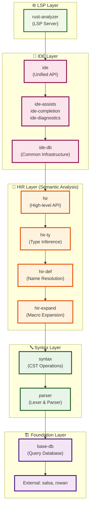
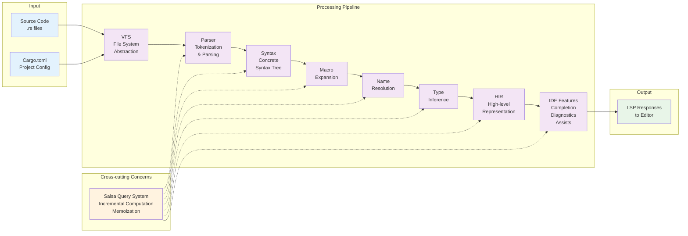

# rust-analyzer 依存関係図

rust-analyzerのクレート間依存関係をMermaidグラフで可視化したものです。

## 完全な依存関係グラフ

```mermaid
graph TB
    %% External Dependencies
    subgraph "External Dependencies"
        salsa["salsa<br/>(Query System)"]
        rowan["rowan<br/>(Red-Green Tree)"]
        lsp["lsp-types<br/>(LSP Protocol)"]
        tokio["tokio<br/>(Async Runtime)"]
    end

    %% Foundation Layer
    subgraph "Foundation Layer"
        basedb["base-db<br/>(Database Traits)"]
        vfs["vfs<br/>(Virtual File System)"]
        stdx["stdx<br/>(Utilities)"]
        profile["profile<br/>(Performance)"]
        paths["paths<br/>(Path Types)"]
        span["span<br/>(Source Spans)"]
        edition["edition<br/>(Rust Editions)"]
    end

    %% Token & Syntax Layer
    subgraph "Token & Syntax Layer"
        tt["tt<br/>(Token Trees)"]
        parser["parser<br/>(Lexer & Parser)"]
        syntax["syntax<br/>(CST Operations)"]
        syntaxbridge["syntax-bridge<br/>(Syntax Conversion)"]
    end

    %% HIR Layer (High-level IR)
    subgraph "HIR Layer"
        mbe["mbe<br/>(Macro-by-Example)"]
        hirexpand["hir-expand<br/>(Macro Expansion)"]
        hirdef["hir-def<br/>(Name Resolution)"]
        hirty["hir-ty<br/>(Type Inference)"]
        hir["hir<br/>(High-level API)"]
        cfg["cfg<br/>(Conditional Compilation)"]
    end

    %% IDE Foundation
    subgraph "IDE Foundation"
        idedb["ide-db<br/>(IDE Database)"]
    end

    %% IDE Features
    subgraph "IDE Features"
        idediagnostics["ide-diagnostics<br/>(Error Detection)"]
        idecompletion["ide-completion<br/>(Code Completion)"]
        ideassists["ide-assists<br/>(Refactoring)"]
        idessr["ide-ssr<br/>(Structural Search/Replace)"]
    end

    %% IDE Unified
    subgraph "IDE Unified"
        ide["ide<br/>(Unified IDE API)"]
    end

    %% Project Management
    subgraph "Project Management"
        projectmodel["project-model<br/>(Cargo Integration)"]
        loadcargo["load-cargo<br/>(Project Loading)"]
        toolchain["toolchain<br/>(Rust Toolchain)"]
    end

    %% LSP Layer
    subgraph "LSP Layer"
        rustanalyzer["rust-analyzer<br/>(LSP Server)"]
    end

    %% External Dependencies to Foundation
    salsa --> basedb
    rowan --> syntax
    lsp --> rustanalyzer
    tokio --> rustanalyzer

    %% Foundation Layer Internal Dependencies
    basedb --> vfs
    basedb --> stdx
    basedb --> profile
    basedb --> paths
    span --> basedb

    %% Token & Syntax Layer Dependencies
    parser --> rowan
    parser --> stdx
    syntax --> parser
    syntax --> rowan
    syntax --> stdx
    syntax --> span
    syntaxbridge --> syntax
    syntaxbridge --> tt
    tt --> syntax

    %% HIR Layer Dependencies - Major Data Flow
    mbe --> syntax
    mbe --> tt
    mbe --> parser
    
    hirexpand --> syntax
    hirexpand --> basedb
    hirexpand --> mbe
    hirexpand --> tt
    hirexpand --> span
    hirexpand --> stdx

    cfg --> tt

    hirdef --> hirexpand
    hirdef --> syntax
    hirdef --> basedb
    hirdef --> cfg
    hirdef --> tt
    hirdef --> span
    hirdef --> stdx

    hirty --> hirdef
    hirty --> hirexpand
    hirty --> syntax
    hirty --> basedb
    hirty --> cfg
    hirty --> span
    hirty --> stdx

    hir --> hirty
    hir --> hirdef
    hir --> hirexpand
    hir --> syntax
    hir --> basedb
    hir --> span

    %% IDE Foundation Dependencies
    idedb --> hir
    idedb --> hirty
    idedb --> hirdef
    idedb --> hirexpand
    idedb --> syntax
    idedb --> basedb
    idedb --> vfs
    idedb --> stdx
    idedb --> span

    %% IDE Features Dependencies
    idediagnostics --> idedb
    idediagnostics --> hir
    idediagnostics --> hirty
    idediagnostics --> syntax

    idecompletion --> idedb
    idecompletion --> hir
    idecompletion --> hirty
    idecompletion --> hirdef
    idecompletion --> hirexpand
    idecompletion --> syntax
    idecompletion --> stdx

    ideassists --> idedb
    ideassists --> hir
    ideassists --> hirty
    ideassists --> hirdef
    ideassists --> syntax
    ideassists --> stdx

    idessr --> idedb
    idessr --> hir
    idessr --> syntax

    %% IDE Unified Dependencies
    ide --> idedb
    ide --> idediagnostics
    ide --> idecompletion
    ide --> ideassists
    ide --> idessr
    ide --> hir
    ide --> hirty
    ide --> hirdef
    ide --> syntax
    ide --> basedb
    ide --> vfs

    %% Project Management Dependencies
    toolchain --> paths
    projectmodel --> basedb
    projectmodel --> paths
    projectmodel --> toolchain
    projectmodel --> cfg
    loadcargo --> projectmodel
    loadcargo --> vfs
    loadcargo --> basedb

    %% LSP Layer Dependencies
    rustanalyzer --> ide
    rustanalyzer --> idedb
    rustanalyzer --> hir
    rustanalyzer --> vfs
    rustanalyzer --> basedb
    rustanalyzer --> profile
    rustanalyzer --> projectmodel
    rustanalyzer --> loadcargo

    %% Styling
    classDef external fill:#e1f5fe,stroke:#01579b,stroke-width:2px
    classDef foundation fill:#f3e5f5,stroke:#4a148c,stroke-width:2px
    classDef syntax fill:#e8f5e8,stroke:#1b5e20,stroke-width:2px
    classDef hir fill:#fff3e0,stroke:#e65100,stroke-width:2px
    classDef ide fill:#fce4ec,stroke:#880e4f,stroke-width:2px
    classDef project fill:#f9fbe7,stroke:#33691e,stroke-width:2px
    classDef lsp fill:#f1f8e9,stroke:#2e7d32,stroke-width:2px

    class salsa,rowan,lsp,tokio external
    class basedb,vfs,stdx,profile,paths,span,edition foundation
    class tt,parser,syntax,syntaxbridge syntax
    class cfg,mbe,hirexpand,hirdef,hirty,hir hir
    class idedb,idediagnostics,idecompletion,ideassists,idessr,ide ide  
    class projectmodel,loadcargo,toolchain project
    class rustanalyzer lsp
```

## 簡略化されたレイヤー図



## データフロー図



## アーキテクチャの要点

### 🏗️ レイヤー構造（下位→上位）
1. **Foundation Layer**: データベース基盤、VFS、ユーティリティ
2. **Syntax Layer**: パーシングとCST操作
3. **HIR Layer**: 意味解析（マクロ→名前解決→型推論→高レベルAPI）
4. **IDE Layer**: IDE機能実装
5. **LSP Layer**: エディタとの通信

### 🔄 主要データフロー
```
ソースコード → VFS → Syntax(CST) → HIR-Expand(マクロ) → HIR-Def(名前) → HIR-Ty(型) → HIR(API) → IDE機能 → LSP → エディタ
```

### 🔑 重要な外部依存
- **Salsa**: 増分計算フレームワーク（クエリシステム、メモ化）
- **Rowan**: Red-Green tree実装（ロスレス構文木）
- **LSP-Types**: Language Server Protocol型定義

### 💡 設計原則の反映
- **増分計算**: Salsaによるクエリベース増分計算
- **堅牢性**: 各レイヤーで部分的失敗を処理して継続
- **メモリファースト**: VFSでファイル状態管理、全データをメモリ保持
- **クエリベース**: Salsaクエリシステムによる効率的キャッシュ

この構造により、rust-analyzerは高速で増分的な解析を提供しながら、構文解析、意味解析、IDE機能実装の間で明確な分離を維持できています。