# Issue #20215: rust-analyzer パターンマッチ名前解決バグの包括的解析

## 📋 目次

1. [問題概要とアーキテクチャ](#1-問題概要とアーキテクチャ)
2. [AST構造と依存関係](#2-ast構造と依存関係)
3. [処理フローの詳細解析](#3-処理フローの詳細解析)
4. [修正実装の完全ガイド](#4-修正実装の完全ガイド)
5. [モジュール間依存関係](#5-モジュール間依存関係)
6. [実装パターンと応用](#6-実装パターンと応用)

---

## 1. 問題概要とアーキテクチャ

### 🎯 Issue #20215の核心問題

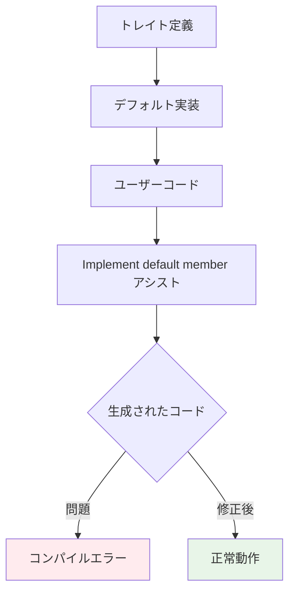

### 🔍 具体的な問題事例

```rust
// 1️⃣ 標準ライブラリのトレイト定義
pub trait RangeBounds<T: ?Sized> {
    fn start_bound(&self) -> Bound<&T>;
    fn end_bound(&self) -> Bound<&T>;
    
    // デフォルト実装（問題の発生源）
    fn is_empty(&self) -> bool 
    where T: PartialOrd<T> {
        !match (self.start_bound(), self.end_bound()) {
            (Unbounded, _) | (_, Unbounded) => true,  // ← 短縮名
            (Included(start), Excluded(end)) => start >= end,
            // ...
        }
    }
}

// 2️⃣ ユーザーの実装
struct MyRange;
impl RangeBounds<usize> for MyRange {
    fn start_bound(&self) -> Bound<&usize> { todo!() }
    fn end_bound(&self) -> Bound<&usize> { todo!() }
    // ← ここで "Implement default member" を実行
}

// 3️⃣ 生成されたコード（修正前）
impl RangeBounds<usize> for MyRange {
    fn start_bound(&self) -> Bound<&usize> { todo!() }
    fn end_bound(&self) -> Bound<&usize> { todo!() }
    
    fn is_empty(&self) -> bool {
        !match (self.start_bound(), self.end_bound()) {
            (Unbounded, _) | (_, Unbounded) => true,  // ❌ エラー！
            (std::ops::Bound::Included(start), std::ops::Bound::Excluded(end)) => start >= end,
            // ...
        }
    }
}

// 4️⃣ 修正後の正しいコード
impl RangeBounds<usize> for MyRange {
    fn start_bound(&self) -> Bound<&usize> { todo!() }
    fn end_bound(&self) -> Bound<&usize> { todo!() }
    
    fn is_empty(&self) -> bool {
        !match (self.start_bound(), self.end_bound()) {
            (std::ops::Bound::Unbounded, _) | (_, std::ops::Bound::Unbounded) => true,  // ✅ 正常！
            (std::ops::Bound::Included(start), std::ops::Bound::Excluded(end)) => start >= end,
            // ...
        }
    }
}
```

### 🏗 rust-analyzerのコード生成アーキテクチャ

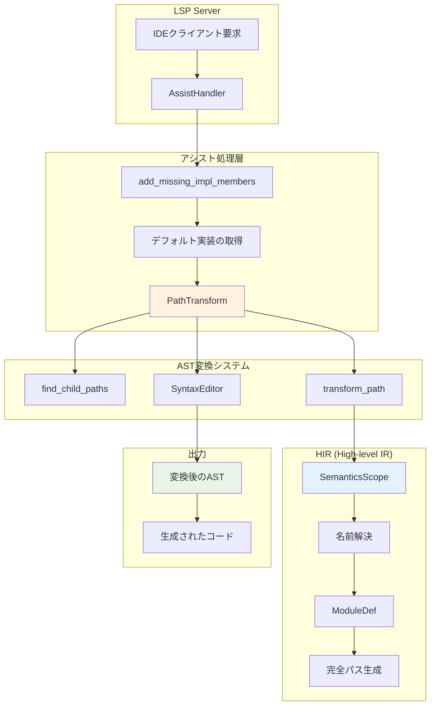

### 🔧 PathTransformの役割と重要性

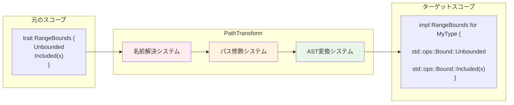

---

## 2. AST構造と依存関係

### 🌳 ASTノード階層構造

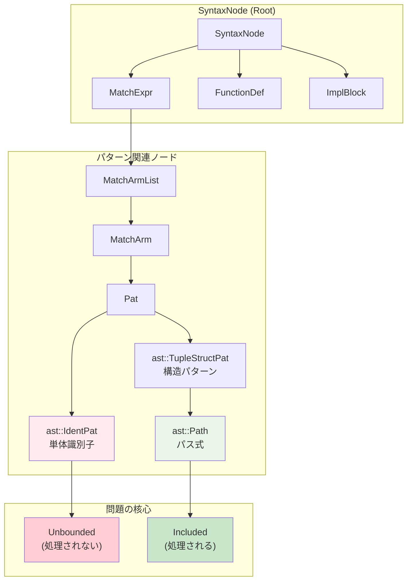

### 🔍 ASTノード型の詳細比較

```rust
// パターンマッチングでの各要素のAST表現

match bound {
    Unbounded => true,           // ast::IdentPat
    //^^^^^^^^^ 単体の識別子パターン
    
    Included(value) => false,    // ast::TupleStructPat
    //^^^^^^^ ast::Path (パス部分)
    //        ^^^^^ ast::Pat (引数部分)
}
```

### 📊 ノード種別と処理状況

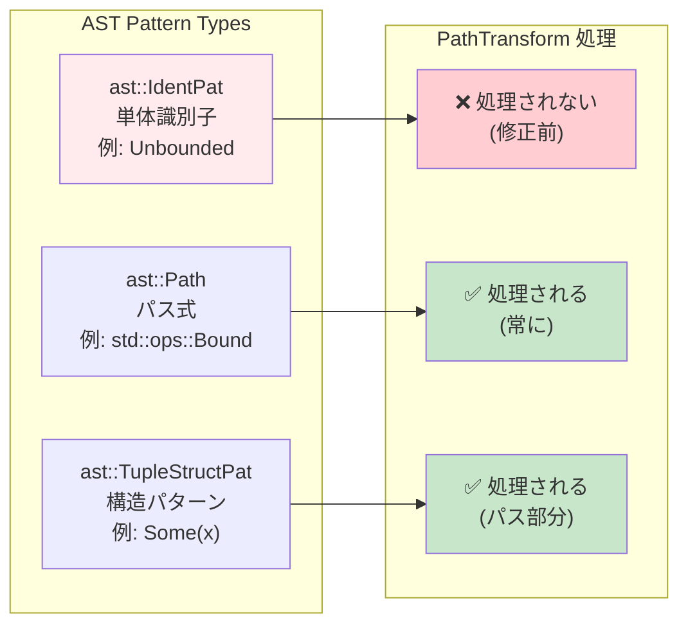

### 🧬 HasNameトレイトの実装階層

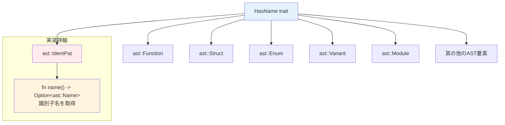

---

## 3. 処理フローの詳細解析

### 🔄 修正前の処理フロー（問題あり）

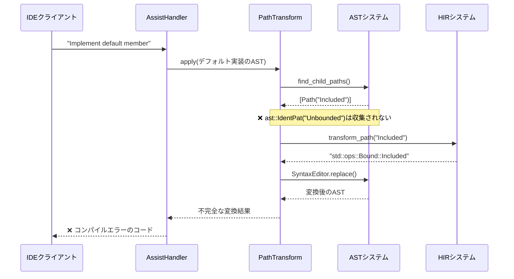

### 🔄 修正後の処理フロー（正常動作）

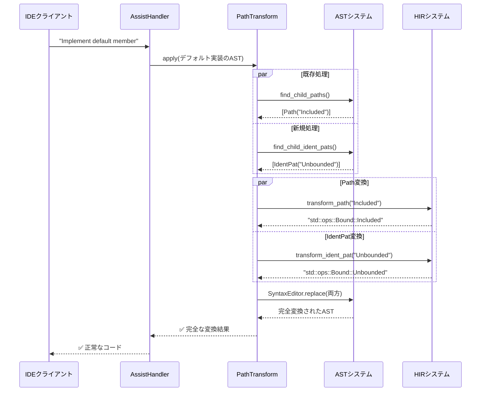

### 🎯 transform_ident_patの内部処理詳細

```mermaid
graph TD
    A["transform_ident_pat(ast::IdentPat)"] --> B[name = ident_pat.name()]
    B --> C["temp_path = make::path_from_text(name)"]
    C --> D["resolution = source_scope.speculative_resolve(temp_path)"]
    
    D --> E{"PathResolution の種類判定"}
    E -->|Def(def)| F["ImportPathConfig 設定"]
    E -->|その他| G[None を返却]
    
    F --> H["found_path = target_module.find_path(def, config)"]
    H --> I["ast_path = mod_path_to_ast(found_path)"]
    I --> J["Some(ast_path) を返却"]
    
    subgraph "エラーハンドリング"
        B -->|失敗| K[None]
        D -->|失敗| K
        H -->|失敗| K
        K --> L["元のまま保持"]
    end
    
    style E fill:#fff3e0
    style G fill:#ffebee
    style J fill:#e8f5e8
    style L fill:#fff9c4
```

### 🔍 名前解決の詳細メカニズム

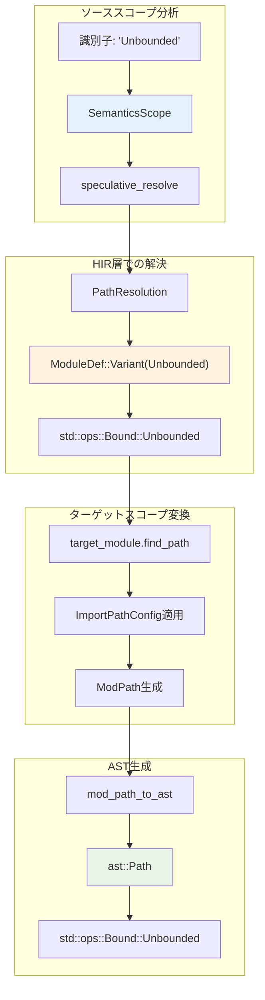

---

## 4. 修正実装の完全ガイド

### 📝 コード変更の全体像

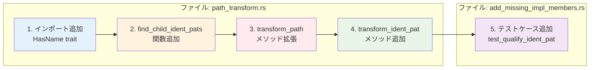

### 🔧 1. HasNameトレイトのインポート追加

```rust
// 修正前
use syntax::{
    ast::{self, AstNode, HasGenericArgs, make},
    //                                    ^^^^^^ HasName が不足
};

// 修正後  
use syntax::{
    ast::{self, AstNode, HasGenericArgs, HasName, make},
    //                                    ^^^^^^^ 追加
};
```

**追加理由**:
```rust
// HasNameトレイトの使用例
impl HasName for ast::IdentPat {
    fn name(&self) -> Option<ast::Name> {
        // ast::IdentPatから識別子名を取得するために必要
    }
}
```

### 🔧 2. find_child_ident_pats関数の実装

```rust
fn find_child_ident_pats(root_path: &SyntaxNode) -> Vec<ast::IdentPat> {
    let mut result = Vec::new();
    
    // 再帰的AST走査アルゴリズム
    for child in root_path.children() {
        if let Some(child_ident_pat) = ast::IdentPat::cast(child.clone()) {
            // ✅ ast::IdentPatノード発見
            result.push(child_ident_pat);
        } else {
            // 🔄 子ノードを再帰的に探索
            result.extend(find_child_ident_pats(&child));
        }
    }
    result
}
```

**アルゴリズムの特徴**:
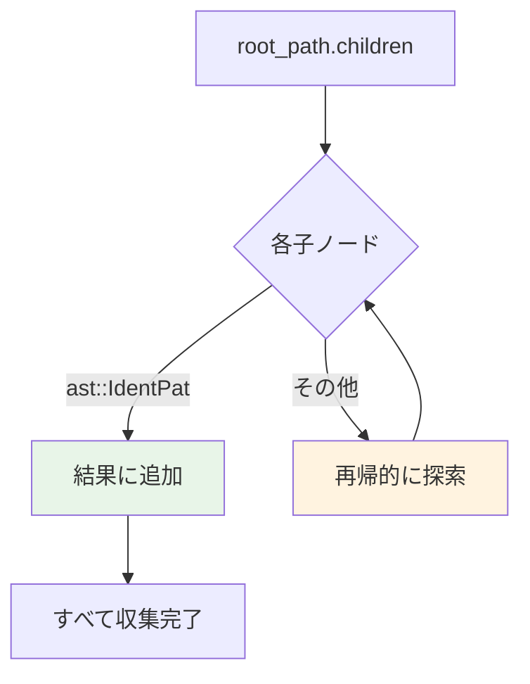

### 🔧 3. transform_pathメソッドの拡張

```rust
// 既存のコード（ast::Path処理）
let result = find_child_paths(&root_path);
for path in result {
    let new = self.transform_path_(&mut editor, &path);
    // ... 既存の変換処理
}

// 新規追加（ast::IdentPat処理）
let ident_result = find_child_ident_pats(&root_path);
for ident_pat in ident_result {
    if let Some(new) = self.transform_ident_pat(&ident_pat) {
        editor.replace(ident_pat.syntax(), new.syntax());
    }
}
```

**並列処理パターン**:
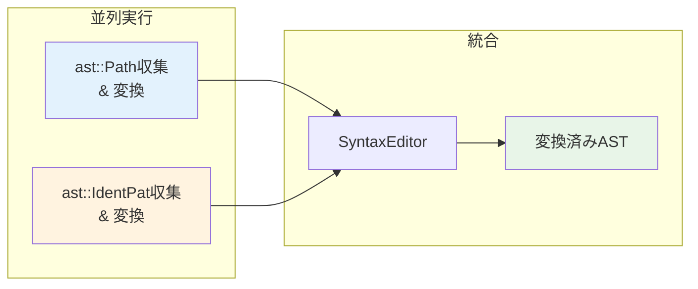

### 🔧 4. transform_ident_patメソッドの実装

```rust
fn transform_ident_pat(&self, ident_pat: &ast::IdentPat) -> Option<ast::Path> {
    // ステップ1: 名前抽出
    let name = ident_pat.name()?;
    
    // ステップ2: 仮想パス作成
    let temp_path = make::path_from_text(&name.text());
    
    // ステップ3: 名前解決
    let resolution = self.source_scope.speculative_resolve(&temp_path)?;
    
    // ステップ4: 解決結果の検証
    match resolution {
        hir::PathResolution::Def(def) if def.as_assoc_item(self.source_scope.db).is_none() => {
            // ステップ5: インポート設定
            let cfg = ImportPathConfig {
                prefer_no_std: false,
                prefer_prelude: true,
                prefer_absolute: false,
                allow_unstable: true,
            };
            
            // ステップ6: 完全パス検索
            let found_path = self.target_module.find_path(self.source_scope.db, def, cfg)?;
            
            // ステップ7: AST変換
            let res = mod_path_to_ast(&found_path, self.target_edition).clone_for_update();
            Some(res)
        }
        _ => None,
    }
}
```

**各ステップの詳細フロー**:
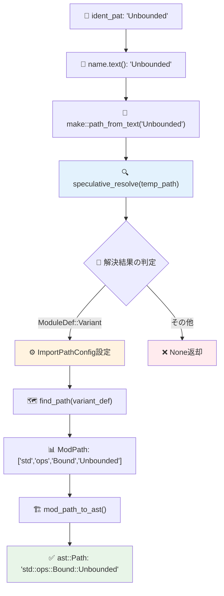

---

## 5. モジュール間依存関係

### 🏗 関連クレートとモジュールの構造

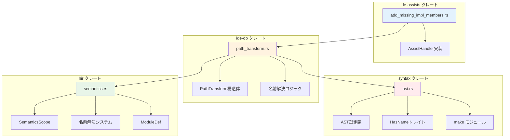

### 🔗 依存関係の詳細マッピング

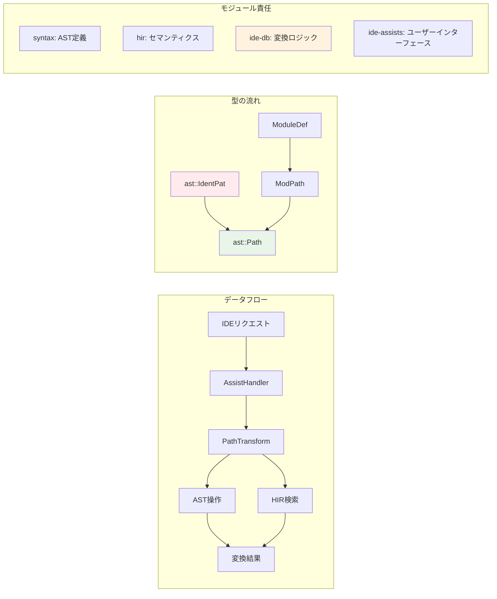

### 📦 ImportPathConfigの設定詳細

```rust
let cfg = ImportPathConfig {
    prefer_no_std: false,      // std使用を優先
    prefer_prelude: true,      // prelude項目は短縮
    prefer_absolute: false,    // 相対パス優先  
    allow_unstable: true,      // unstable機能許可
};
```

**設定の影響例**:
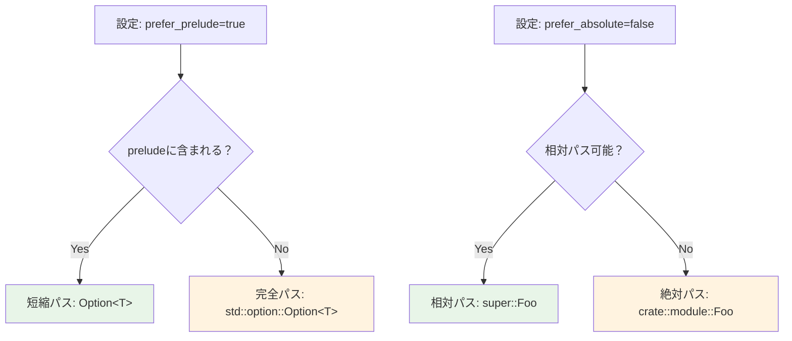

---

## 6. 実装パターンと応用

### 🎨 類似問題への応用パターン

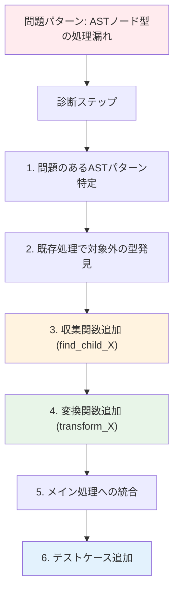

### 🧩 拡張可能な設計パターン

```rust
// 抽象化されたパターン変換トレイト
trait PatternTransformer {
    type Input: AstNode;
    type Output: AstNode;
    
    fn find_patterns(&self, root: &SyntaxNode) -> Vec<Self::Input>;
    fn transform_pattern(&self, pattern: &Self::Input) -> Option<Self::Output>;
}

// 具体的な実装例
struct IdentPatTransformer<'a> {
    context: &'a TransformContext,
}

impl PatternTransformer for IdentPatTransformer<'_> {
    type Input = ast::IdentPat;
    type Output = ast::Path;
    
    fn find_patterns(&self, root: &SyntaxNode) -> Vec<ast::IdentPat> {
        find_child_ident_pats(root)
    }
    
    fn transform_pattern(&self, pattern: &ast::IdentPat) -> Option<ast::Path> {
        self.context.transform_ident_pat(pattern)
    }
}
```

### 🚀 パフォーマンス最適化戦略

```mermaid
graph LR
    subgraph "最適化前"
        A[重複AST走査]
        A --> B[N回の走査]
        B --> C[O(n×m) 複雑度]
    end
    
    subgraph "最適化後"  
        D[単一AST走査]
        D --> E[1回の走査]
        E --> F[O(n) 複雑度]
    end
    
    subgraph "キャッシュ戦略"
        G[解決結果キャッシュ]
        G --> H[重複解決回避]
        H --> I[メモリ vs 時間のトレードオフ]
    end
    
    style C fill:#ffebee
    style F fill:#e8f5e8
    style I fill:#fff3e0
```

### 🧪 テスト戦略とデバッグ手法

```rust
// デバッグヘルパー関数
fn debug_ast_structure(node: &SyntaxNode, depth: usize) {
    let indent = "  ".repeat(depth);
    println!("{}{}({:?})", indent, node.kind(), node.text());
    
    for child in node.children() {
        debug_ast_structure(&child, depth + 1);
    }
}

// テスト駆動開発パターン
#[test] 
fn test_ident_pat_transformation() {
    check_assist(
        add_missing_impl_members,
        r#"
trait Foo {
    fn default() -> Self {
        match value {
            Unbounded => Self,  // ← この部分をテスト
        }
    }
}
struct Bar;
impl Foo for Bar {<|>}
        "#,
        r#"
struct Bar;
impl Foo for Bar {
    fn default() -> Self {
        match value {
            std::ops::Bound::Unbounded => Self,  // ← 期待される結果
        }
    }
}
        "#,
    );
}
```

### 📊 エラーハンドリング戦略

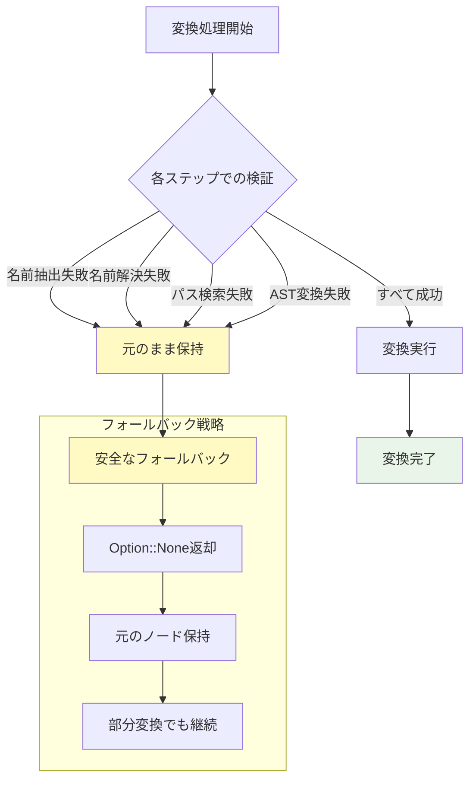

---

## 📚 まとめと学習価値

### 🎯 この修正から学べること

1. **ASTレベルでの精密な操作**: rust-analyzerの内部でどのようにコードが表現・操作されるか
2. **セマンティック解析の活用**: HIRシステムによる高レベルな名前解決メカニズム
3. **拡張可能な設計**: 既存システムに影響を与えない形での機能追加
4. **エラーハンドリング**: 部分的失敗を許容する堅牢なシステム設計

### 🚀 他のissueへの応用可能性

この解析で得られた知識は、以下のような類似問題に直接応用できます：

- **マクロ展開での名前解決問題**
- **ジェネリック型の具体化問題**  
- **モジュール間でのコード移植問題**
- **新しいRust構文への対応**

### 🏆 rust-analyzer貢献への道筋

1. **小さなバグ修正から開始**: Issue #20215のような明確で限定的な問題
2. **テスト駆動での開発**: 修正前にテストケースを作成
3. **既存パターンの理解**: 類似の実装を参考にした一貫性のある解決
4. **段階的な機能追加**: 既存システムへの影響を最小化

このIssue #20215の修正は、rust-analyzerのアーキテクチャを理解し、実際の貢献を行うための優れた入門例です。小さな変更でありながら、AST操作、セマンティック解析、エラーハンドリングなど、多くの重要な概念を含んでいます。