# rust-analyzer Issue #20215: アーキテクチャ・フロー詳細図解

## 📋 目次

1. [システム全体アーキテクチャ](#1-システム全体アーキテクチャ)
2. [データフロー詳細解析](#2-データフロー詳細解析)
3. [AST変換パイプライン](#3-ast変換パイプライン)
4. [HIRセマンティック解析](#4-hirセマンティック解析)
5. [エラーハンドリングフロー](#5-エラーハンドリングフロー)

---

## 1. システム全体アーキテクチャ

### 🏗 rust-analyzerの全体構造とissue #20215の位置

```mermaid
graph TB
    subgraph "🖥 IDE Layer"
        A1[VS Code / IntelliJ / Emacs]
        A2[LSP Client]
    end
    
    subgraph "🌐 LSP Protocol"
        B1[JSON-RPC Messages]
        B2[Code Actions / Assists]
    end
    
    subgraph "🧠 rust-analyzer Core"
        C1[LSP Server]
        C2[Analysis Database]
        C3[Query System]
    end
    
    subgraph "🔧 IDE Features"
        D1[Diagnostics]
        D2[Completion]
        D3[Code Actions]
        D4[Assists]
    end
    
    subgraph "🎯 Issue #20215 の位置"
        E1[add_missing_impl_members]
        E2[PathTransform]
        E3[AST変換システム]
    end
    
    subgraph "📚 Foundation Layers"
        F1[Syntax (rowan)]
        F2[HIR (High-level IR)]
        F3[Type System]
    end
    
    A1 --> A2
    A2 --> B1
    B1 --> C1
    C1 --> C2
    C2 --> C3
    C3 --> D1
    C3 --> D2
    C3 --> D3
    C3 --> D4
    D4 --> E1
    E1 --> E2
    E2 --> E3
    E3 --> F1
    E3 --> F2
    F2 --> F3
    
    style E1 fill:#ffebee
    style E2 fill:#fff3e0
    style E3 fill:#e8f5e8
```

### 🔄 Issue #20215 修正の影響範囲

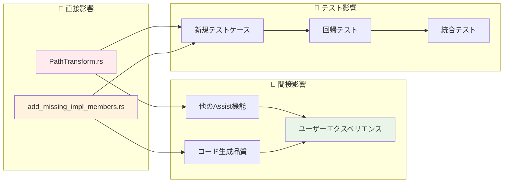

---

## 2. データフロー詳細解析

### 🌊 Issue #20215 のデータフロー全体像

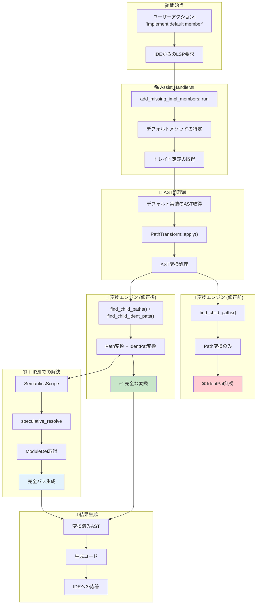

### 📊 データ変換の詳細ステップ

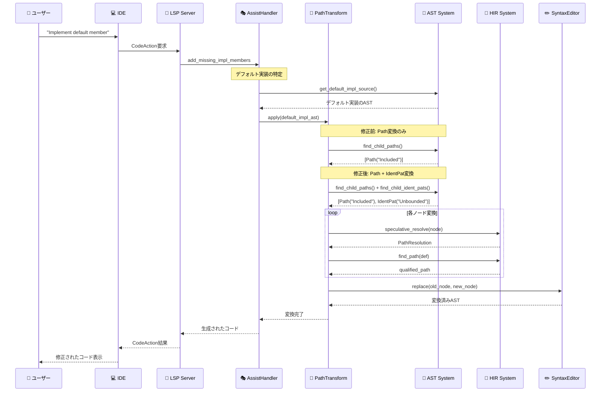

---

## 3. AST変換パイプライン

### 🌳 ASTノード処理の詳細フロー

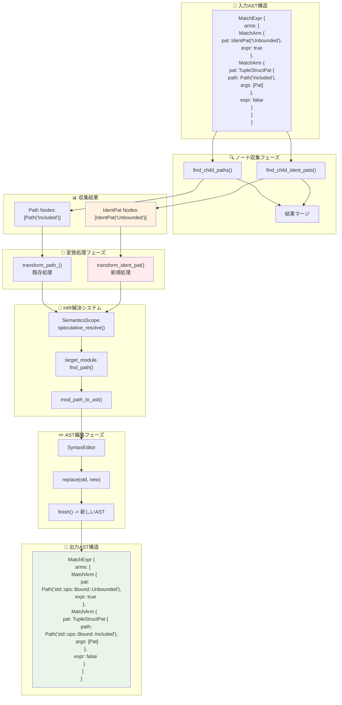

### 🔧 transform_ident_patの詳細処理フロー

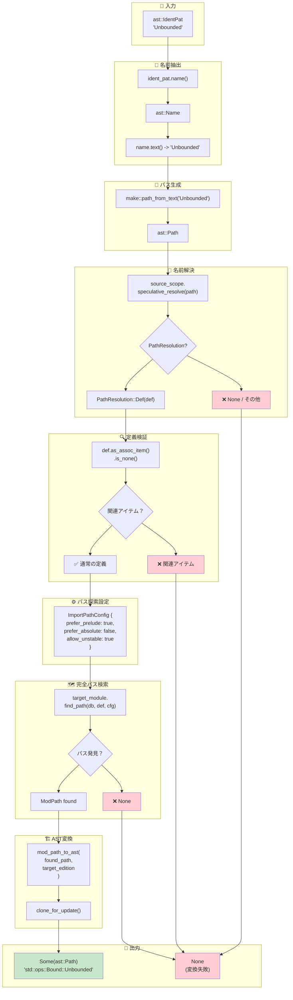

---

## 4. HIRセマンティック解析

### 🧠 SemanticsScope による名前解決詳細

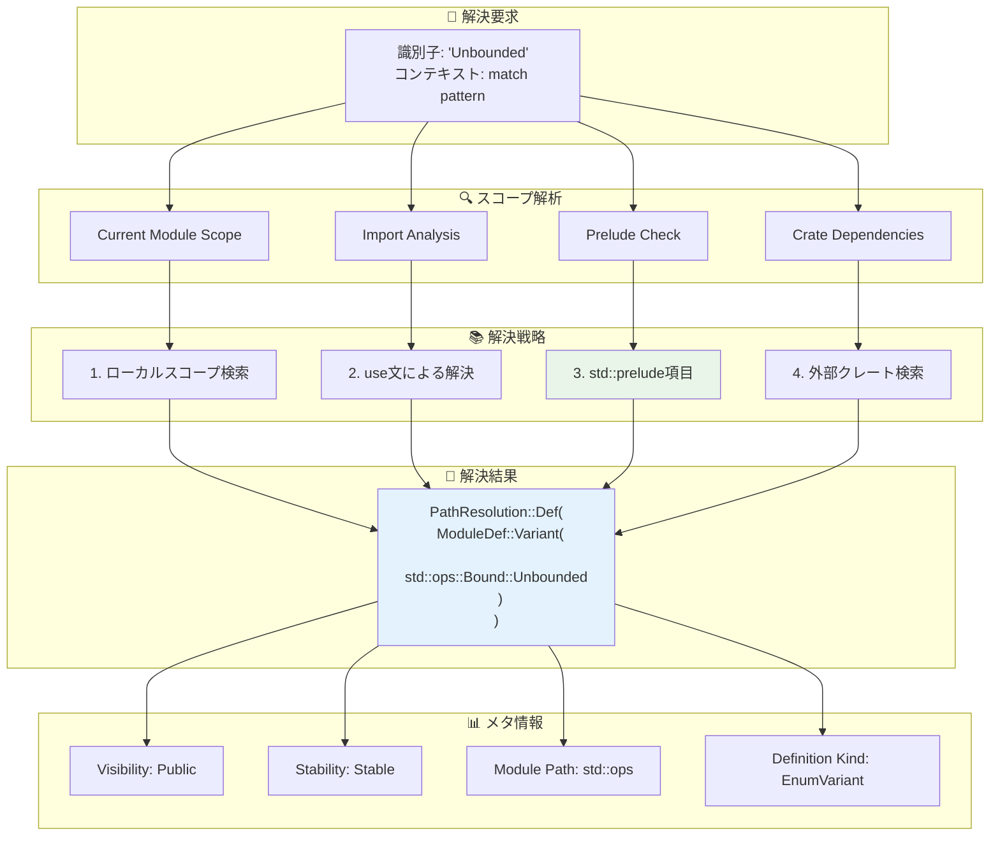

### 🗺️ find_pathアルゴリズムの詳細

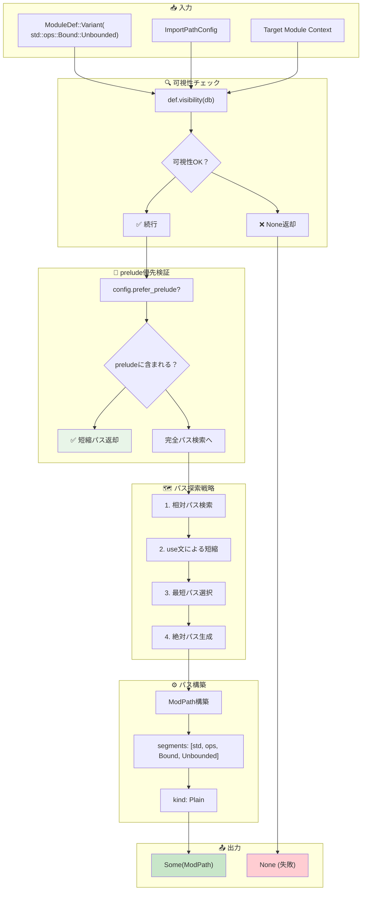

### 🔄 ModPath から ast::Path への変換詳細

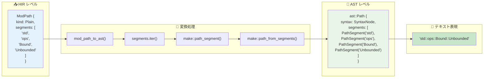

---

## 5. エラーハンドリングフロー

### 🛡️ 堅牢性を保つエラーハンドリング戦略

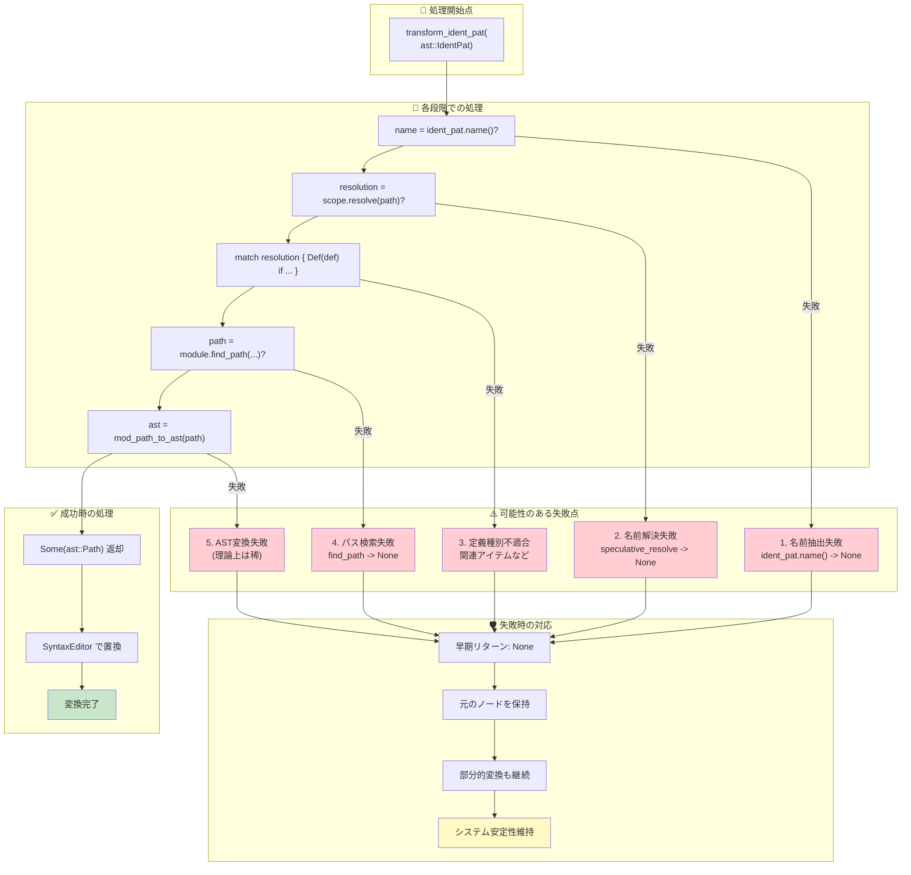

### 🔄 部分変換許容による堅牢性

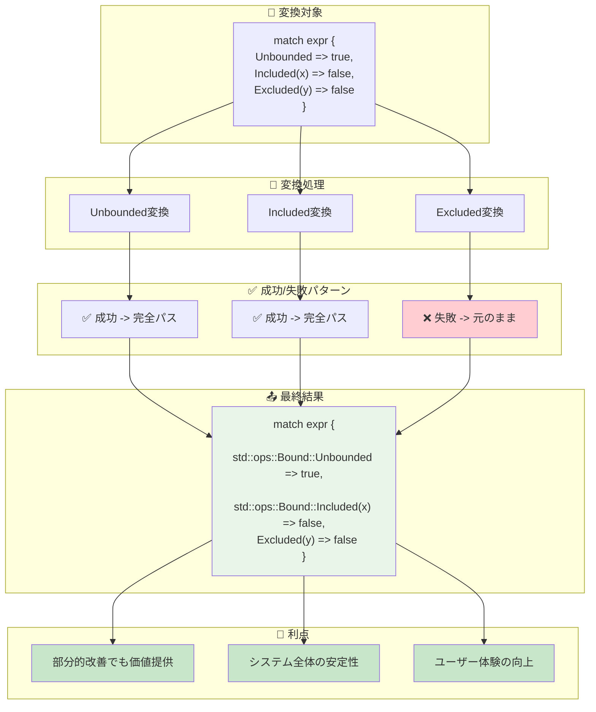

### 📊 エラーケース分類と対応戦略

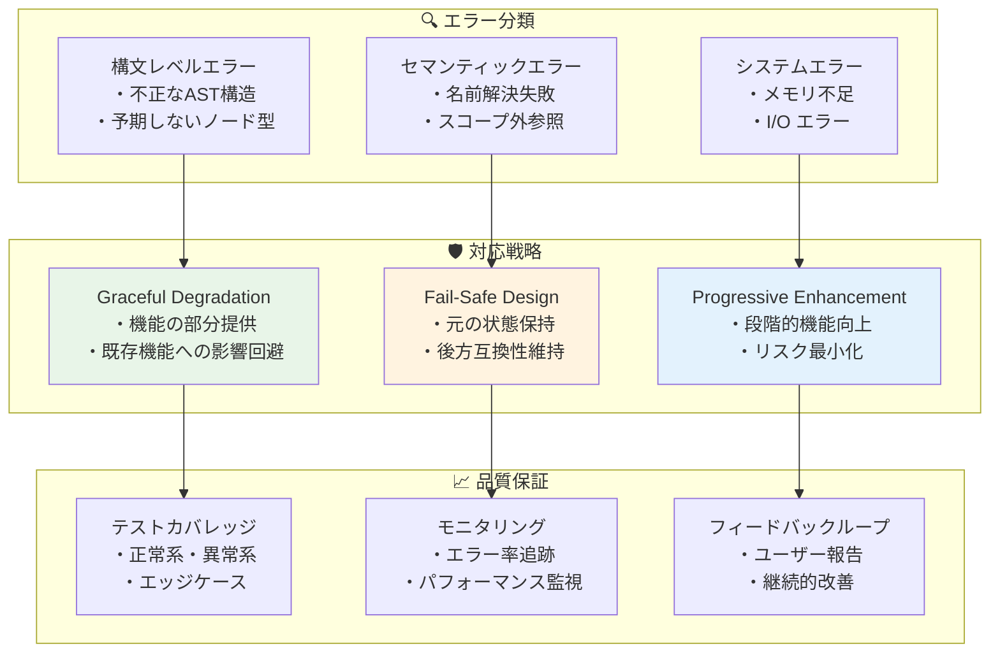

---

## 📚 まとめ

### 🎯 アーキテクチャ・フローから得られる洞察

1. **階層化された責任分離**: LSPレイヤー、Assistレイヤー、ASTレイヤー、HIRレイヤーが明確に分離
2. **柔軟な拡張性**: 既存システムに影響を与えない新機能追加パターン
3. **堅牢なエラーハンドリング**: 部分失敗を許容する設計による安定性
4. **効率的なデータフロー**: 最小限の変更で最大の効果を実現

### 🚀 他の問題への応用ポイント

- **AST変換問題**: 同様のパターン収集・変換アーキテクチャが適用可能
- **名前解決問題**: HIRシステムの活用方法が参考になる
- **コード生成問題**: SyntaxEditorを使った安全な変換手法
- **エラーハンドリング**: Optionチェーンによる早期リターンパターン

この詳細なアーキテクチャ・フロー解析により、Issue #20215の修正がrust-analyzer全体の中でどのような位置づけにあり、どのような設計思想に基づいているかが明確になります。