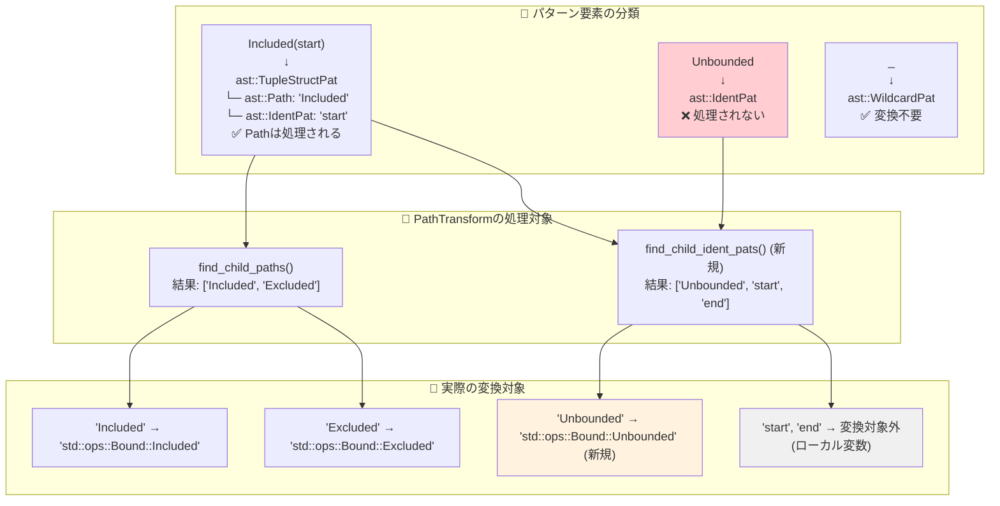
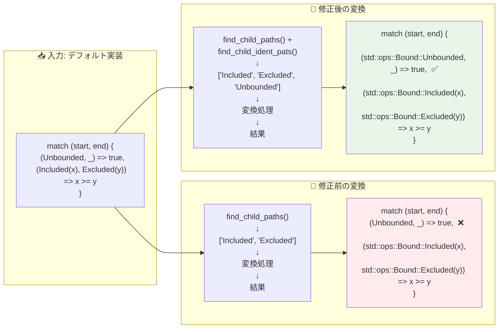
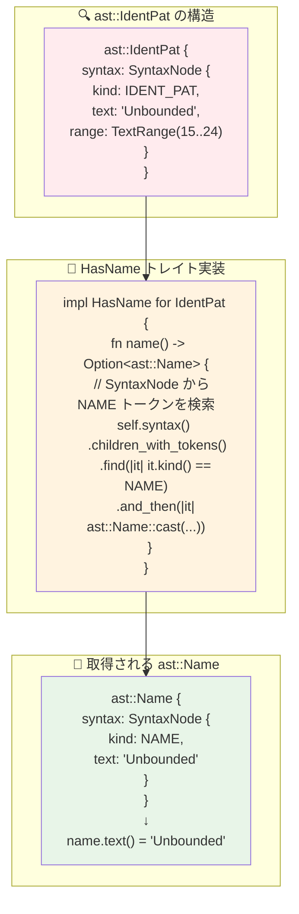
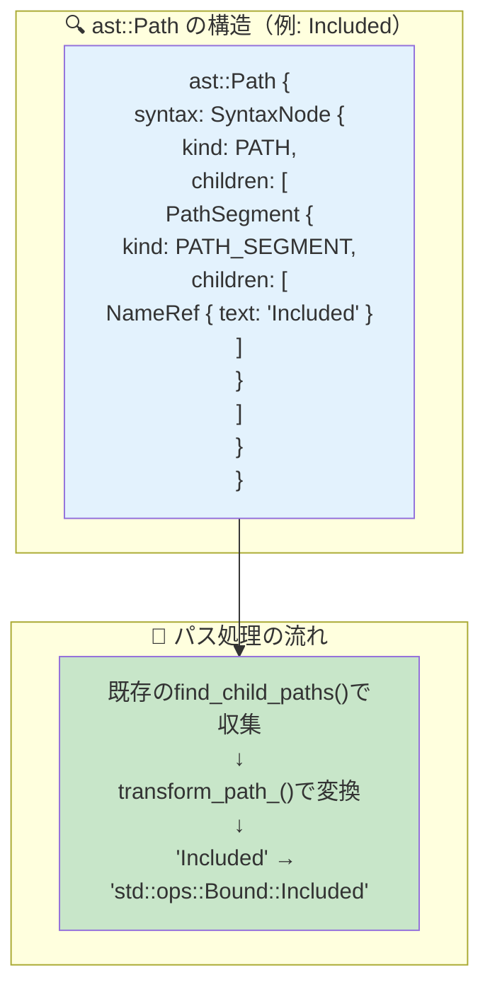
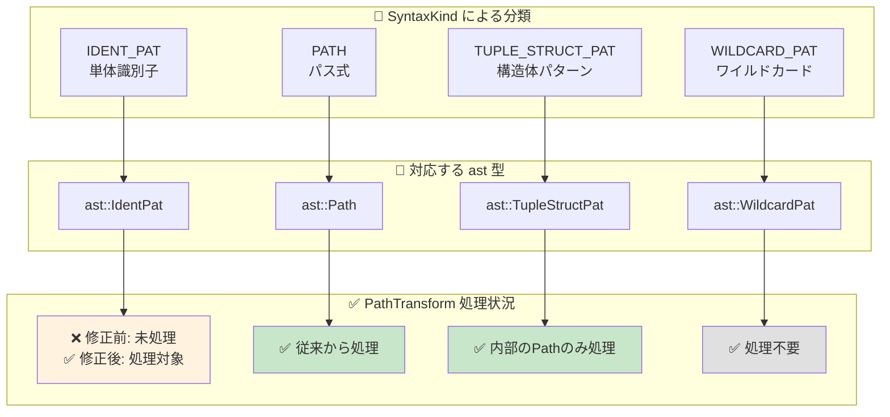
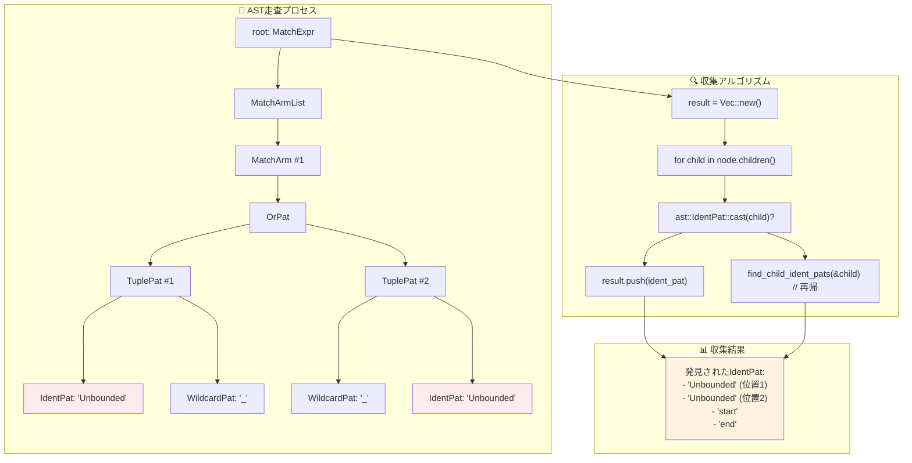
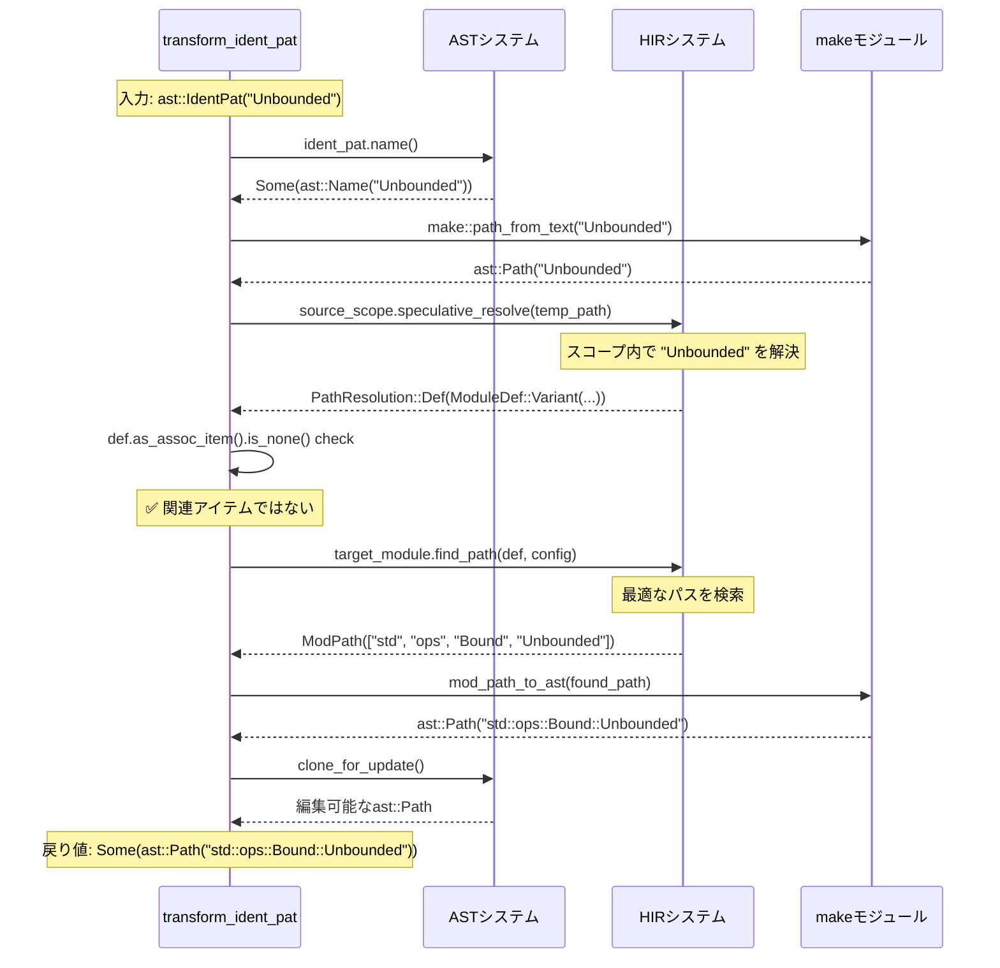
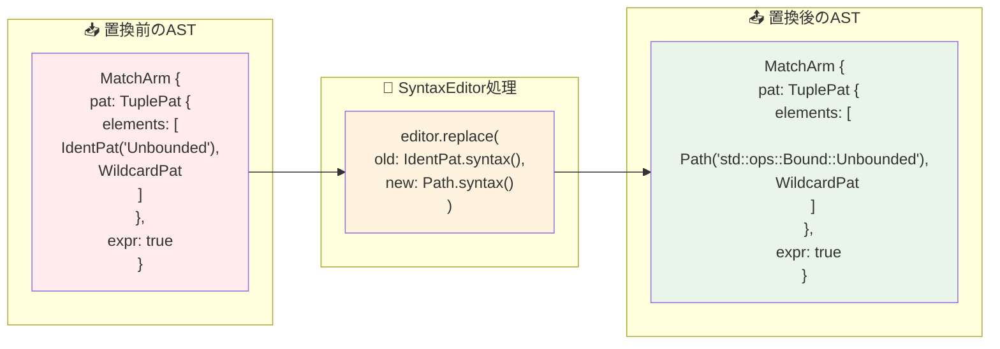

# rust-analyzer Issue #20215: AST変換の詳細例解説

## 📋 目次

1. [AST構造の可視化](#1-ast構造の可視化)
2. [変換前後の詳細比較](#2-変換前後の詳細比較)
3. [実際のASTノード構造](#3-実際のastノード構造)
4. [変換アルゴリズムの動作例](#4-変換アルゴリズムの動作例)
5. [エッジケースとその処理](#5-エッジケースとその処理)

---

## 1. AST構造の可視化

### 🌳 問題となるコードのAST構造（詳細版）

```mermaid
graph TD
    subgraph "🎯 元のトレイトデフォルト実装"
        A1["fn is_empty() -> bool"]
    end
    
    subgraph "🌳 AST階層構造"
        B1[FunctionDef]
        B1 --> B2[BlockExpr]
        B2 --> B3[ReturnExpr]
        B3 --> B4[PrefixExpr (!)]
        B4 --> B5[MatchExpr]
    end
    
    subgraph "🎯 MatchExpr の内部構造"
        C1[MatchArmList]
        C2[MatchArm #1]
        C3[MatchArm #2]
        C4[MatchArm #3]
        C1 --> C2
        C1 --> C3
        C1 --> C4
    end
    
    subgraph "🔍 MatchArm #1 詳細（問題の箇所）"
        D1[TuplePat]
        D2["OrPat: (Unbounded, _) | (_, Unbounded)"]
        D3[TuplePat #1]
        D4[TuplePat #2]
        D2 --> D3
        D2 --> D4
        D3 --> D5["IdentPat: 'Unbounded'"]  
        D3 --> D6["WildcardPat: '_'"]
        D4 --> D7["WildcardPat: '_'"]
        D4 --> D8["IdentPat: 'Unbounded'"]
    end
    
    subgraph "🔍 MatchArm #2 詳細（正常動作）"
        E1[TuplePat]
        E2[TupleStructPat #1]
        E3[TupleStructPat #2]
        E1 --> E2
        E1 --> E3
        E2 --> E4["Path: 'Included'"]
        E2 --> E5[IdentPat: 'start']
        E3 --> E6["Path: 'Excluded'"]
        E3 --> E7[IdentPat: 'end']
    end
    
    B5 --> C1
    C2 --> D1
    C3 --> E1
    D1 --> D2
    E1 --> E2
    
    style D5 fill:#ffcdd2
    style D8 fill:#ffcdd2
    style E4 fill:#c8e6c9
    style E6 fill:#c8e6c9
```

### 📊 ASTノード型の分類と処理状況

```rust
// 実際のRustコード
fn is_empty(&self) -> bool {
    !match (self.start_bound(), self.end_bound()) {
        (Unbounded, _) | (_, Unbounded) => true,        // ← 問題箇所
        (Included(start), Excluded(end)) => start >= end, // ← 正常動作
        _ => false,
    }
}
```



---

## 2. 変換前後の詳細比較

### 🔍 変換処理の段階的可視化



### 📝 テキストレベルでの変換詳細

```rust
// 🎯 元のコード（トレイトのデフォルト実装）
impl<T> RangeBounds<T> for MyRange 
where T: ?Sized + PartialOrd<T> {
    fn is_empty(&self) -> bool {
        !match (self.start_bound(), self.end_bound()) {
            (Unbounded, _) | (_, Unbounded) => true,
            //^^^^^^^ ast::IdentPat - 修正前は変換されない
            (Included(start), Excluded(end)) => start >= end,
            //^^^^^^^ ast::Path - 従来から変換される
            _ => false,
        }
    }
}

// ❌ 修正前の生成コード（コンパイルエラー）
impl RangeBounds<usize> for MyRange {
    fn is_empty(&self) -> bool {
        !match (self.start_bound(), self.end_bound()) {
            (Unbounded, _) | (_, Unbounded) => true,  // エラー！Unboundedが見つからない
            (std::ops::Bound::Included(start), 
             std::ops::Bound::Excluded(end)) => start >= end,
            _ => false,
        }
    }
}

// ✅ 修正後の生成コード（正常動作）
impl RangeBounds<usize> for MyRange {
    fn is_empty(&self) -> bool {
        !match (self.start_bound(), self.end_bound()) {
            (std::ops::Bound::Unbounded, _) | 
            (_, std::ops::Bound::Unbounded) => true,  // 正常！
            (std::ops::Bound::Included(start), 
             std::ops::Bound::Excluded(end)) => start >= end,
            _ => false,
        }
    }
}
```

---

## 3. 実際のASTノード構造

### 🧬 ast::IdentPat の内部構造



### 🔧 ast::Path の構造（比較用）



### 📊 SyntaxKind の種類と判定

```rust
// SyntaxKind の実際の判定処理
match node.kind() {
    SyntaxKind::IDENT_PAT => {
        // ast::IdentPat として処理
        // 例: "Unbounded" in match pattern
    },
    SyntaxKind::PATH => {
        // ast::Path として処理  
        // 例: "std::ops::Bound" や "Included"
    },
    SyntaxKind::TUPLE_STRUCT_PAT => {
        // ast::TupleStructPat として処理
        // 例: "Included(value)" 全体
    },
    _ => {
        // その他のパターン
    }
}
```



---

## 4. 変換アルゴリズムの動作例

### 🔄 find_child_ident_pats の詳細動作

```rust
// 入力ASTの例
match (self.start_bound(), self.end_bound()) {
    (Unbounded, _) | (_, Unbounded) => true,
    (Included(start), Excluded(end)) => start >= end,
    _ => false,
}
```



### 🧠 transform_ident_pat の詳細実行例



### 🔧 SyntaxEditor による置換処理



---

## 5. エッジケースとその処理

### 🎯 変換対象となるIdentPat vs 変換対象外のIdentPat

```rust
// 複雑なパターンマッチの例
match value {
    // ✅ 変換対象: enum variantの短縮名
    Some(x) => process(x),        // "Some" は変換される可能性
    None => default(),            // "None" は変換される可能性
    
    // ❌ 変換対象外: ローカル変数
    my_var => handle(my_var),     // "my_var" は変換されない
    
    // ✅ 変換対象: 他のクレートの型
    Ok(result) => success(result), // "Ok" は変換される可能性
    Err(error) => failure(error),  // "Err" は変換される可能性
    
    // ❌ 変換対象外: 特殊パターン
    _ => unreachable!(),          // ワイルドカードは変換不要
}
```

```mermaid
graph TD
    subgraph "🔍 IdentPat の分類"
        A1[enum variant<br/>例: Some, None, Ok, Err]
        A2[ローカル変数<br/>例: x, result, error]
        A3[関数・定数名<br/>例: MY_CONST]
        A4[モジュール内型<br/>例: CustomEnum::Variant]
    end
    
    subgraph "🧠 名前解決結果"
        B1[PathResolution::Def(<br/>ModuleDef::Variant)]
        B2[PathResolution::Local(<br/>Local)]
        B3[PathResolution::Def(<br/>ModuleDef::Const)]
        B4[PathResolution::Def(<br/>ModuleDef::Variant)]
    end
    
    subgraph "✅ 変換判定"
        C1[✅ 変換実行<br/>qualified path 生成]
        C2[❌ 変換スキップ<br/>元のまま保持]
        C3[✅ 変換実行<br/>qualified path 生成]
        C4[✅ 変換実行<br/>qualified path 生成]
    end
    
    A1 --> B1 --> C1
    A2 --> B2 --> C2
    A3 --> B3 --> C3
    A4 --> B4 --> C4
    
    style C1 fill:#c8e6c9
    style C2 fill:#ffcdd2
    style C3 fill:#c8e6c9
    style C4 fill:#c8e6c9
```

### 🛡️ エラーハンドリングの具体例

```rust
// 各段階でのエラーハンドリング例
fn transform_ident_pat(&self, ident_pat: &ast::IdentPat) -> Option<ast::Path> {
    // 1. 名前抽出でのエラー（稀だが可能）
    let name = ident_pat.name()?;  // 不正なAST構造の場合None
    
    // 2. パス作成（通常は成功）
    let temp_path = make::path_from_text(&name.text());
    
    // 3. 名前解決でのエラー（よくある）
    let resolution = self.source_scope.speculative_resolve(&temp_path)?;
    // 例: スコープ外の名前、typoされた名前など
    
    // 4. 定義種別チェック
    match resolution {
        hir::PathResolution::Def(def) if def.as_assoc_item(self.source_scope.db).is_none() => {
            // 5. パス検索でのエラー（可能性あり）
            let found_path = self.target_module.find_path(self.source_scope.db, def, cfg)?;
            // 例: privateな定義、不適切なスコープなど
            
            // 6. AST変換（通常は成功）
            let res = mod_path_to_ast(&found_path, self.target_edition).clone_for_update();
            Some(res)
        }
        _ => None,  // 関連アイテムや予期しない解決結果
    }
}
```

```mermaid
flowchart TD
    subgraph "🎯 成功パス"
        A1[Valid IdentPat] --> A2[Name Extract Success]
        A2 --> A3[Resolution Success]
        A3 --> A4[Path Found]
        A4 --> A5[AST Generated]
    end
    
    subgraph "❌ 失敗パス 1"
        B1[Invalid IdentPat] --> B2[Name Extract Fail]
        B2 --> B3[Return None]
    end
    
    subgraph "❌ 失敗パス 2"
        C1[Valid IdentPat] --> C2[Name Extract Success]
        C2 --> C3[Resolution Fail]
        C3 --> C4[Return None]
    end
    
    subgraph "❌ 失敗パス 3"
        D1[Valid IdentPat] --> D2[Name Extract Success]
        D2 --> D3[Resolution Success]
        D3 --> D4[Path Not Found]
        D4 --> D5[Return None]
    end
    
    subgraph "🎉 結果"
        E1[Some(qualified_path)]
        E2[None (graceful failure)]
    end
    
    A5 --> E1
    B3 --> E2
    C4 --> E2
    D5 --> E2
    
    style A5 fill:#c8e6c9
    style E1 fill:#c8e6c9
    style E2 fill:#fff9c4
```

### 📊 実際のテストケースによる検証

```rust
// テストケース1: 正常な変換
#[test]
fn test_enum_variant_qualification() {
    check_transform(
        r#"match x { Unbounded => true }"#,
        r#"match x { std::ops::Bound::Unbounded => true }"#,
    );
}

// テストケース2: ローカル変数は変換されない  
#[test]
fn test_local_variable_unchanged() {
    check_transform(
        r#"match x { my_var => handle(my_var) }"#,
        r#"match x { my_var => handle(my_var) }"#,  // 変更されない
    );
}

// テストケース3: 部分的変換
#[test] 
fn test_partial_transformation() {
    check_transform(
        r#"match x { 
            Unbounded => true, 
            unknown_name => false,
            Included(y) => process(y)
        }"#,
        r#"match x { 
            std::ops::Bound::Unbounded => true,        // ✅ 変換される
            unknown_name => false,                     // ❌ 変換されない  
            std::ops::Bound::Included(y) => process(y) // ✅ 変換される
        }"#,
    );
}
```

---

## 📚 まとめ

### 🎯 AST変換の核心理解

1. **ASTノード型の正確な理解**: `ast::IdentPat` vs `ast::Path` の違いとその処理方法
2. **階層的な変換処理**: 収集 → 解決 → 変換 → 置換の4段階プロセス
3. **エラー耐性の設計**: 部分失敗を許容する堅牢なアーキテクチャ
4. **実用的な応用**: 類似問題への解決パターンの提供

### 🚀 他の問題への応用可能性

この詳細なAST変換例解説により、以下のような問題にも同様のアプローチが適用できます：

- **マクロ展開における名前解決**
- **ジェネリック型の具体化**
- **新しいRust構文への対応**
- **IDE機能の品質向上**

Issue #20215の修正は、単なるバグフィックスを超えて、rust-analyzerの AST 処理システムの理解を深める優れた学習材料となっています。