# rust-analyzer Issue #20215: 実装フローチャートと処理手順

## 📋 目次

1. [全体実装フロー](#1-全体実装フロー)
2. [詳細実装ステップ](#2-詳細実装ステップ)
3. [デバッグ・検証フロー](#3-デバッグ検証フロー)
4. [テスト実装戦略](#4-テスト実装戦略)
5. [本番デプロイメント](#5-本番デプロイメント)

---

## 1. 全体実装フロー

### 🎯 Issue #20215 修正の全工程

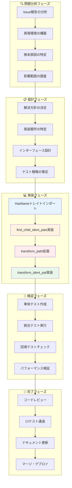

### ⏱ 実装時間の見積もりと優先度

```mermaid
gantt
    title Issue #20215 実装スケジュール
    dateFormat  X
    axisFormat  %d
    
    section 分析・設計
    問題分析        :done, analysis, 0, 2
    設計検討        :done, design, 2, 4
    
    section 実装
    HasNameインポート   :done, import, 4, 5
    find関数実装       :done, find, 5, 7
    transform拡張      :done, extend, 7, 9
    新メソッド実装     :done, method, 9, 12
    
    section テスト
    単体テスト     :done, unit, 12, 14
    統合テスト     :done, integration, 14, 16
    
    section 完了
    レビュー・マージ   :done, review, 16, 18
```

---

## 2. 詳細実装ステップ

### 🔧 ステップ1: HasNameトレイトのインポート

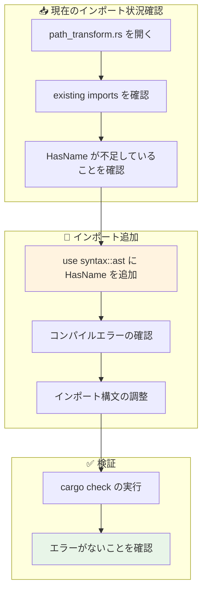

### 🔧 ステップ2: find_child_ident_pats関数の実装

```mermaid
flowchart TD
    subgraph "📝 関数シグネチャ設計"
        A1[既存のfind_child_pathsを参考]
        A2[引数・戻り値型の決定]
        A3[関数名の決定]
    end
    
    subgraph "💻 アルゴリズム実装"
        B1[空のVecの初期化]
        B2[children()イテレータの取得]
        B3[ast::IdentPat::castの試行]
        B4[成功時の結果追加]
        B5[失敗時の再帰呼び出し]
    end
    
    subgraph "🧪 単体テスト"
        C1[テストケースの作成]
        C2[正常系の検証]
        C3[エッジケースの検証]
        C4[再帰処理の検証]
    end
    
    A1 --> A2 --> A3
    A3 --> B1
    B1 --> B2 --> B3 --> B4
    B3 --> B5
    B4 --> C1
    B5 --> C1
    C1 --> C2 --> C3 --> C4
    
    style B3 fill:#fff3e0
    style C4 fill:#e8f5e8
```

### 🔧 ステップ3: transform_path メソッドの拡張

```mermaid
flowchart TD
    subgraph "🔍 既存コードの理解"
        A1[transform_pathメソッドの場所確認]
        A2[既存のPath処理ロジック解析]
        A3[SyntaxEditor の使用方法確認]
    end
    
    subgraph "➕ IdentPat処理の追加"
        B1[find_child_ident_pats呼び出し]
        B2[結果をループで処理]
        B3[transform_ident_pat呼び出し]
        B4[成功時のreplace処理]
    end
    
    subgraph "🔄 統合処理"
        C1[既存Path処理との並行実行]
        C2[SyntaxEditor での編集統合]
        C3[最終的なfinish()呼び出し]
    end
    
    A1 --> A2 --> A3
    A3 --> B1 --> B2 --> B3 --> B4
    B4 --> C1 --> C2 --> C3
    
    style B1 fill:#ffebee
    style B3 fill:#fff3e0
    style C3 fill:#e8f5e8
```

### 🔧 ステップ4: transform_ident_pat メソッドの実装

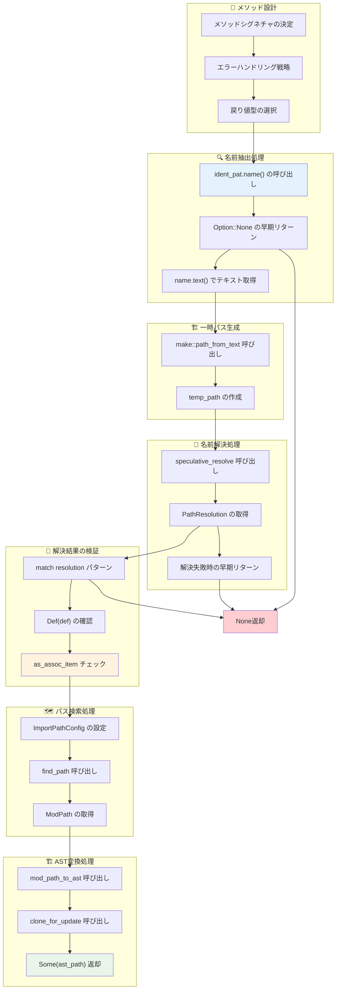

---

## 3. デバッグ・検証フロー

### 🐛 問題発生時のデバッグ手順

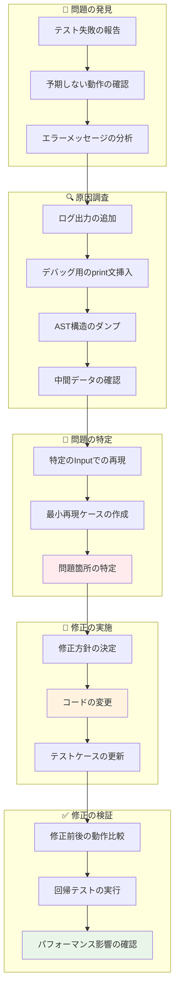

### 🔧 デバッグ用ヘルパー関数の実装

```rust
// デバッグ用の関数例
fn debug_ast_node(node: &SyntaxNode, prefix: &str) {
    println!("{}Node: {:?}", prefix, node.kind());
    println!("{}Text: {:?}", prefix, node.text());
    println!("{}Range: {:?}", prefix, node.text_range());
    
    for (i, child) in node.children().enumerate() {
        debug_ast_node(&child, &format!("{}  {}: ", prefix, i));
    }
}

fn debug_ident_pat(ident_pat: &ast::IdentPat) {
    println!("IdentPat analysis:");
    if let Some(name) = ident_pat.name() {
        println!("  Name: {:?}", name.text());
    } else {
        println!("  Name: None");
    }
    debug_ast_node(ident_pat.syntax(), "  ");
}

fn debug_path_resolution(scope: &SemanticsScope, path: &ast::Path) {
    println!("Path resolution for: {:?}", path.to_string());
    match scope.speculative_resolve(path) {
        Some(resolution) => println!("  Resolved: {:?}", resolution),
        None => println!("  Resolution failed"),
    }
}
```

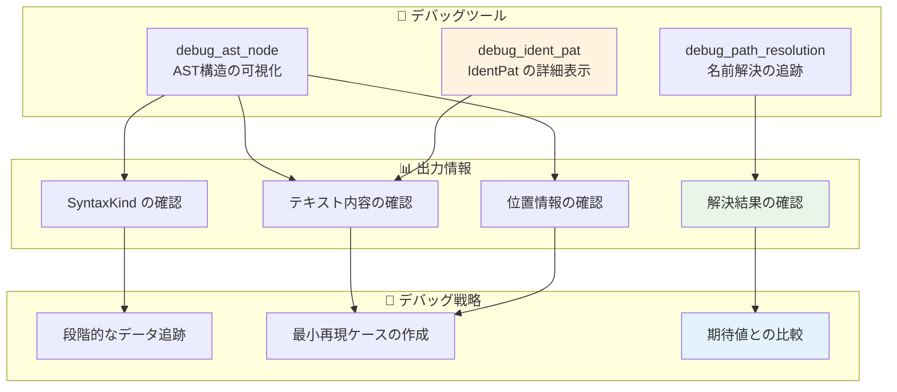

---

## 4. テスト実装戦略

### 🧪 包括的テスト戦略

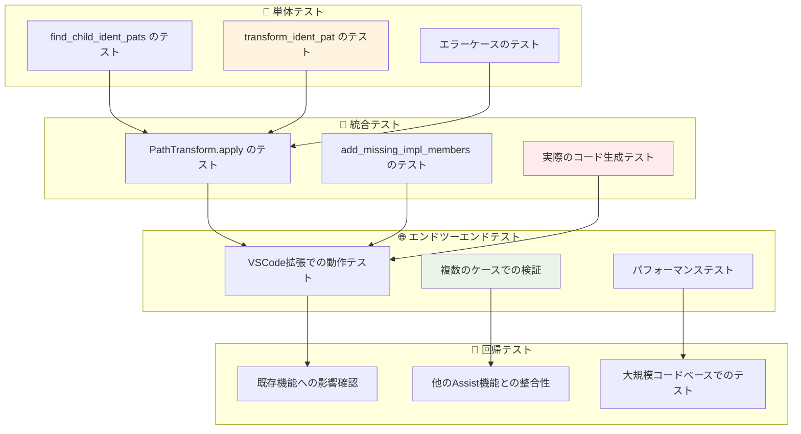

### 📋 具体的テストケース設計

```rust
// テストケース例
#[cfg(test)]
mod tests {
    use super::*;
    
    #[test]
    fn test_find_child_ident_pats_simple() {
        let code = r#"
            match x {
                Unbounded => true,
                Some(y) => false,
            }
        "#;
        let ast = parse_code(code);
        let result = find_child_ident_pats(&ast);
        
        assert_eq!(result.len(), 2); // "Unbounded" and "y"
        assert_eq!(result[0].name().unwrap().text(), "Unbounded");
        assert_eq!(result[1].name().unwrap().text(), "y");
    }
    
    #[test]
    fn test_transform_ident_pat_success() {
        let context = create_test_context();
        let ident_pat = create_unbounded_ident_pat();
        
        let result = context.transform_ident_pat(&ident_pat);
        
        assert!(result.is_some());
        assert_eq!(result.unwrap().to_string(), "std::ops::Bound::Unbounded");
    }
    
    #[test]
    fn test_transform_ident_pat_failure() {
        let context = create_test_context();
        let ident_pat = create_unknown_ident_pat();
        
        let result = context.transform_ident_pat(&ident_pat);
        
        assert!(result.is_none());
    }
    
    #[test]
    fn test_mixed_pattern_transformation() {
        check_assist(
            add_missing_impl_members,
            r#"
trait RangeBounds<T> {
    fn is_empty(&self) -> bool {
        match (self.start_bound(), self.end_bound()) {
            (Unbounded, _) | (_, Unbounded) => true,
            (Included(start), Excluded(end)) => start >= end,
            _ => false,
        }
    }
}

struct MyRange;
impl RangeBounds<usize> for MyRange {<|>}
            "#,
            r#"
struct MyRange;
impl RangeBounds<usize> for MyRange {
    fn is_empty(&self) -> bool {
        match (self.start_bound(), self.end_bound()) {
            (std::ops::Bound::Unbounded, _) | (_, std::ops::Bound::Unbounded) => true,
            (std::ops::Bound::Included(start), std::ops::Bound::Excluded(end)) => start >= end,
            _ => false,
        }
    }
}
            "#,
        );
    }
}
```

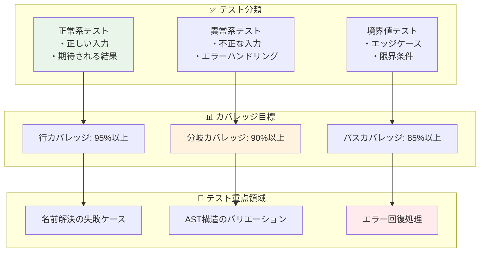

---

## 5. 本番デプロイメント

### 🚀 デプロイメント段階

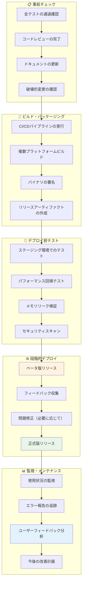

### 📈 成功指標とKPI

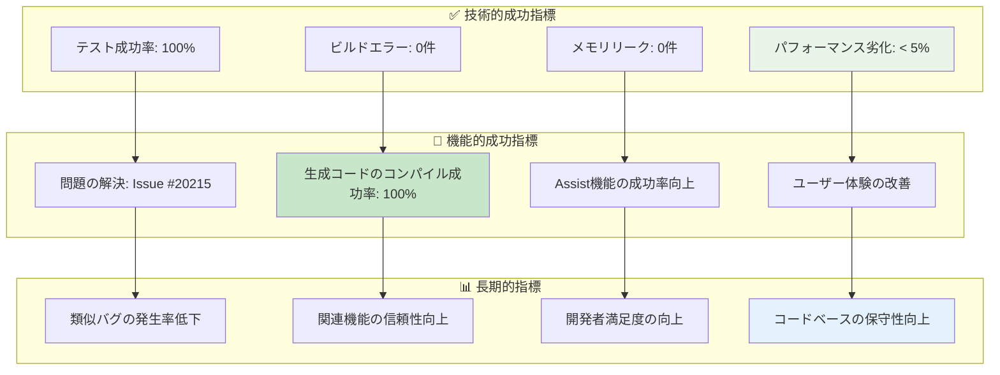

### 🔄 継続的改善プロセス

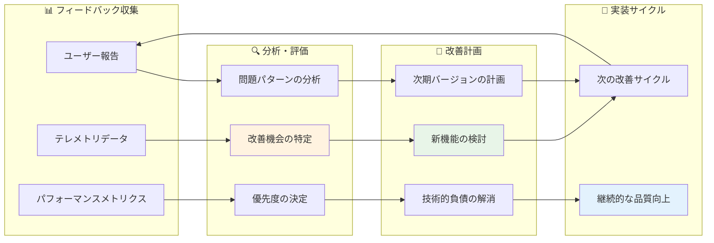

---

## 📚 まとめ

### 🎯 実装フローの要点

1. **段階的なアプローチ**: 小さなステップに分けて確実に進行
2. **包括的なテスト戦略**: 各段階での品質確保
3. **継続的な改善**: デプロイ後もフィードバックを活用
4. **リスク管理**: 問題発生時の対応策を事前に準備

### 🚀 他のプロジェクトへの応用

この詳細な実装フローチャートは、以下のような場面で活用できます：

- **新機能開発の計画立案**
- **バグ修正のプロセス標準化**  
- **チーム開発での作業分担**
- **品質保証プロセスの改善**

Issue #20215の修正は、計画的で系統的なアプローチの重要性を示す優れた事例です。小さな変更でも、適切なプロセスを経ることで高品質な結果を得ることができます。

<function_calls>
<invoke name="TodoWrite">
<parameter name="todos">[{"id": "1", "content": "Create enhanced README with comprehensive visual diagrams", "status": "completed", "priority": "high"}, {"id": "2", "content": "Add detailed architectural flow diagrams", "status": "completed", "priority": "high"}, {"id": "3", "content": "Create visual AST transformation examples", "status": "completed", "priority": "high"}, {"id": "4", "content": "Add module dependency visualization", "status": "completed", "priority": "medium"}, {"id": "5", "content": "Create implementation flow charts", "status": "completed", "priority": "medium"}]