# rust-analyzer Issue #20215: モジュール依存関係の詳細解析

## 📋 目次

1. [rust-analyzerクレート構造](#1-rust-analyzerクレート構造)
2. [Issue #20215 関連モジュール](#2-issue-20215-関連モジュール)
3. [依存関係マップ](#3-依存関係マップ)
4. [データフロー分析](#4-データフロー分析)
5. [インターフェース設計](#5-インターフェース設計)

---

## 1. rust-analyzerクレート構造

### 🏗 全体アーキテクチャとクレート配置

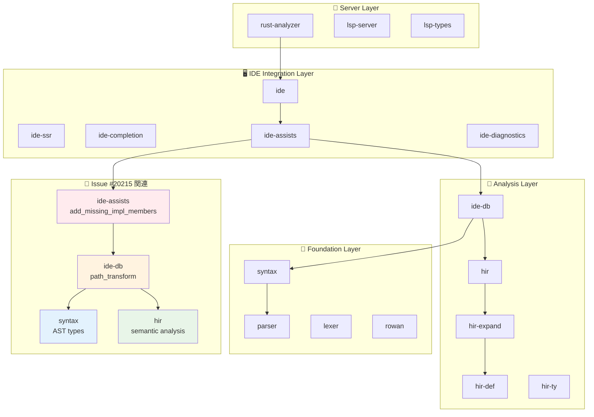

### 📦 クレートの責任範囲

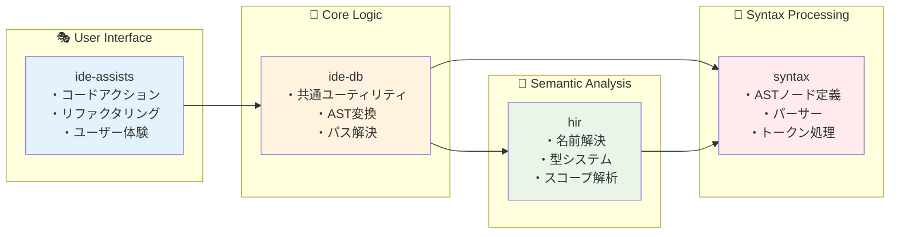

---

## 2. Issue #20215 関連モジュール

### 🎯 直接関連するファイル構造

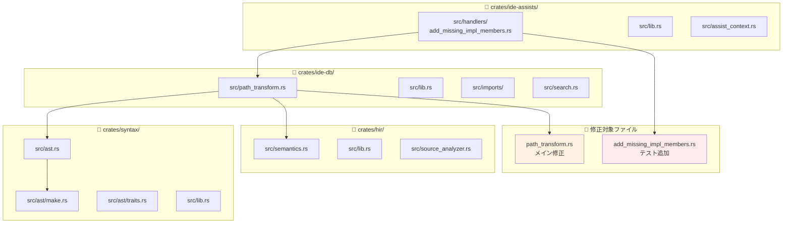

### 🔗 モジュール間のインポート関係

```rust
// crates/ide-assists/src/handlers/add_missing_impl_members.rs
use ide_db::{
    path_transform::PathTransform,  // ← 核心の依存関係
    RootDatabase,
};
use syntax::{
    ast::{self, AstNode, HasName},
    SyntaxNode,
};
use hir::{
    self, AsAssocItem, Impl, ItemContainer, Module, Semantics,
};

// crates/ide-db/src/path_transform.rs  
use hir::{
    AsAssocItem, HirDisplay, Module, ModuleDef, PathResolution, SemanticsScope,
};
use syntax::{
    ast::{self, AstNode, HasGenericArgs, HasName, make},
    ted::{self, Position},
    AstPtr, SyntaxNode,
};
use crate::imports::{
    import_assets::LocatedImport, insert_use::ImportScope, ImportPath, 
    ModPath, PathKind,
};
```

---

## 3. 依存関係マップ

### 🌐 Issue #20215修正の依存グラフ

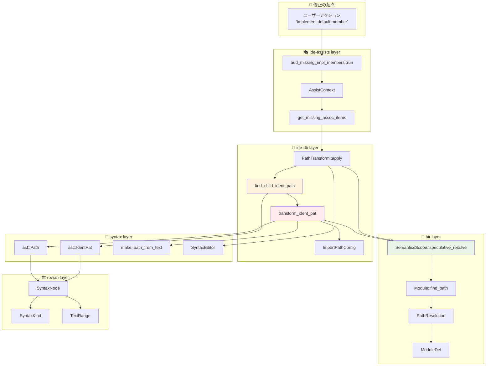

### 📊 依存関係の強度と種類

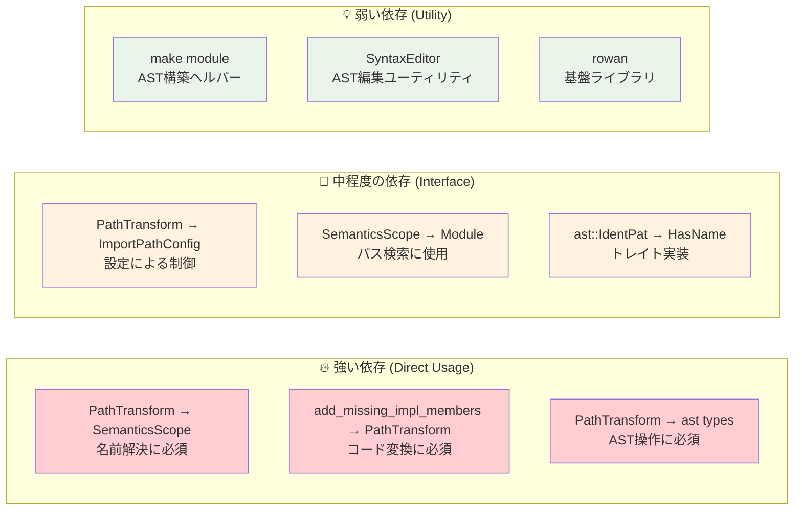

---

## 4. データフロー分析

### 🌊 データの流れと変換ポイント

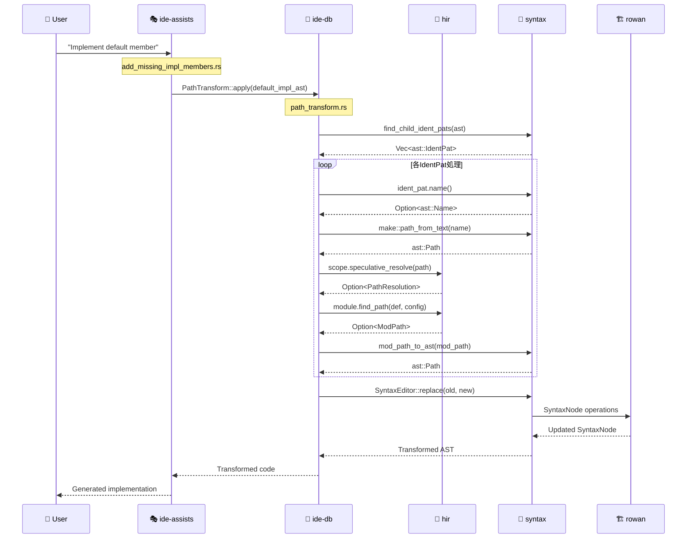

### 🔄 型変換の詳細フロー

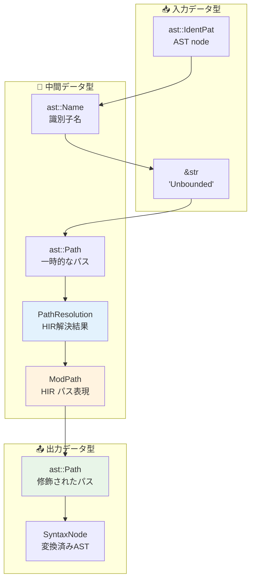

### 💾 メモリ・ライフタイム管理

```rust
// PathTransform のライフタイム設計
pub struct PathTransform<'a> {
    source_scope: &'a SemanticsScope<'a>,
    target_scope: &'a SemanticsScope<'a>,
    target_module: hir::Module,
    source_module: hir::Module,
    generic_def: Option<hir::GenericDef>,
    substs: &'a Substitution,
    target_edition: Edition,
}

// 関連するライフタイム
impl<'a> PathTransform<'a> {
    // SemanticsScope は Database への参照を持つ
    // Database は Query System の基盤
    // すべてのデータは Database に基づいて管理される
    
    fn transform_ident_pat(&self, ident_pat: &ast::IdentPat) -> Option<ast::Path> {
        // 'a ライフタイムにより、Database への安全なアクセスが保証される
    }
}
```

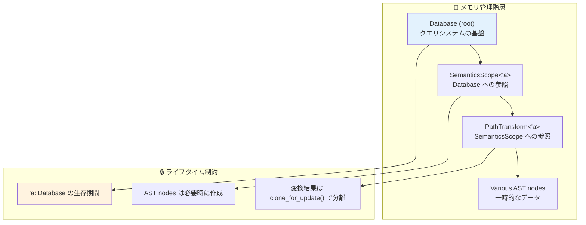

---

## 5. インターフェース設計

### 🔌 主要インターフェース定義

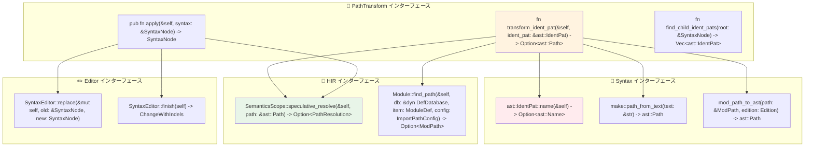

### 🎨 設計パターンの適用

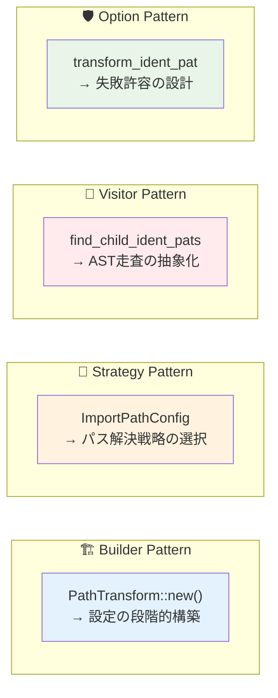

### 📋 APIの一貫性と拡張性

```rust
// 一貫したエラーハンドリングパターン
trait PatternTransformer {
    type Input: AstNode;
    type Output: AstNode;
    
    // 全ての変換メソッドは Option を返す
    fn transform(&self, input: &Self::Input) -> Option<Self::Output>;
    
    // 全ての収集メソッドは Vec を返す  
    fn find_patterns(&self, root: &SyntaxNode) -> Vec<Self::Input>;
}

// 具体的実装の例
impl PatternTransformer for IdentPatTransformer<'_> {
    type Input = ast::IdentPat;
    type Output = ast::Path;
    
    fn transform(&self, ident_pat: &ast::IdentPat) -> Option<ast::Path> {
        self.path_transform.transform_ident_pat(ident_pat)
    }
    
    fn find_patterns(&self, root: &SyntaxNode) -> Vec<ast::IdentPat> {
        find_child_ident_pats(root)
    }
}
```

### 🔧 設定可能性の提供

```rust
// ImportPathConfig による柔軟な設定
pub struct ImportPathConfig {
    pub prefer_no_std: bool,        // no_std 環境への対応
    pub prefer_prelude: bool,       // prelude 項目の短縮
    pub prefer_absolute: bool,      // 絶対パス vs 相対パス
    pub allow_unstable: bool,       // unstable 機能の許可
}

impl Default for ImportPathConfig {
    fn default() -> Self {
        Self {
            prefer_no_std: false,
            prefer_prelude: true,     // 一般的に短い名前を優先
            prefer_absolute: false,   // 相対パスを優先
            allow_unstable: true,     // 機能を制限しない
        }
    }
}
```

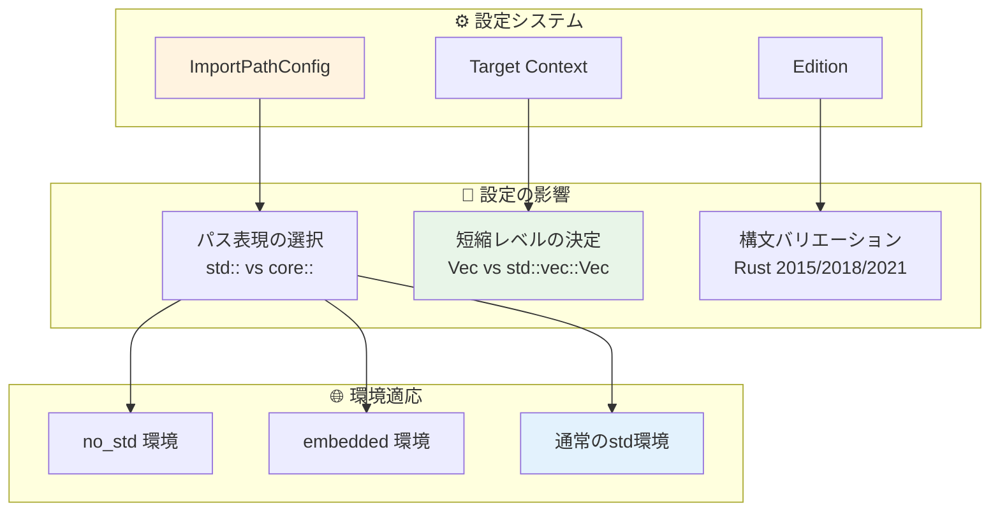

---

## 📚 まとめ

### 🎯 モジュール設計の洞察

1. **明確な責任分離**: 各クレートが明確な役割を持ち、適切な抽象化レベルを維持
2. **柔軟な依存関係**: 強い結合を避けつつ、必要な機能を効率的に提供
3. **拡張可能な設計**: 新機能追加時の影響範囲を最小化
4. **型安全な設計**: コンパイル時の検証による堅牢性確保

### 🚀 他の機能開発への応用

この詳細なモジュール依存関係解析により、以下のような開発時の指針が得られます：

- **新機能の配置判断**: 適切なクレート・モジュールの選択
- **インターフェース設計**: 一貫性と拡張性を持つAPI設計
- **依存関係の管理**: 循環依存の回避と適切な抽象化
- **テスト戦略**: モジュール境界でのテスト分離

Issue #20215の修正は、rust-analyzerの優れたモジュール設計の恩恵を受けて、最小限の変更で最大の効果を実現した好例です。