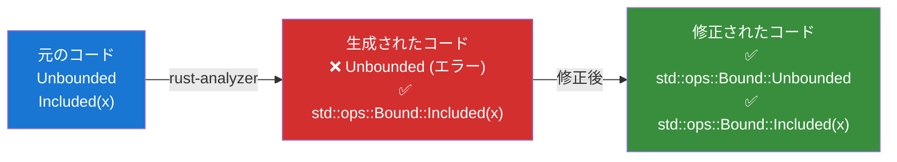
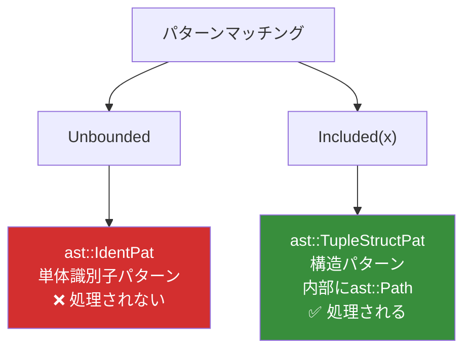
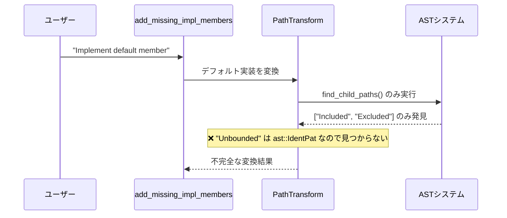
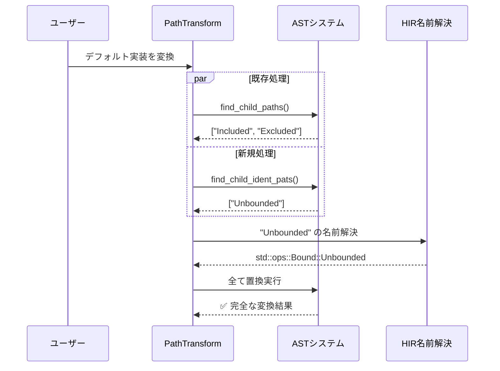
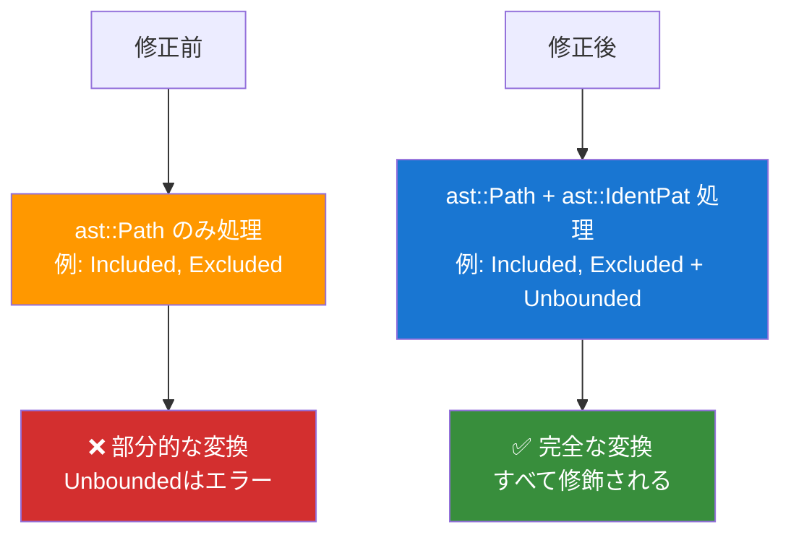

# Issue #20215: パターンマッチ名前解決バグ - 詳細ガイド

## 🎯 問題の核心

### 実際の使用例
```rust
// トレイトのデフォルト実装
pub trait RangeBounds<T: ?Sized> {
    fn is_empty(&self) -> bool {
        match (self.start_bound(), self.end_bound()) {
            (Unbounded, _) | (_, Unbounded) => true,  // ← 問題箇所
            (Included(start), Excluded(end)) => start >= end,
            _ => false,
        }
    }
}

// ユーザーの実装
impl RangeBounds<usize> for MyRange {
    // ← ここで "Implement default member" を実行
}
```

### 問題の流れ


**問題**: `Unbounded` だけが修飾されない → `cannot find value 'Unbounded' in this scope`

---

## 🔍 原因分析

### ASTノードの違い


### PathTransformシステムの動作


**根本原因**: `PathTransform`が`ast::IdentPat`を無視し、`ast::Path`のみを処理していた

---

## 🔧 修正内容

### 修正後の処理フロー


### 主要な修正点

#### 1. HasNameトレイトのインポート
```rust
// crates/ide-db/src/path_transform.rs
use syntax::ast::{self, AstNode, HasGenericArgs, HasName, make};
//                                                 ^^^^^^^
//                                              新規追加
```

#### 2. IdentPat収集関数の追加
```rust
fn find_child_ident_pats(root_path: &SyntaxNode) -> Vec<ast::IdentPat> {
    let mut result = Vec::new();
    for child in root_path.children() {
        if let Some(child_ident_pat) = ast::IdentPat::cast(child.clone()) {
            result.push(child_ident_pat);  // IdentPatを発見・収集
        } else {
            result.extend(find_child_ident_pats(&child));  // 再帰的に探索
        }
    }
    result
}
```

#### 3. IdentPat変換メソッドの実装
```rust
fn transform_ident_pat(&self, ident_pat: &ast::IdentPat) -> Option<ast::Path> {
    // 1. 識別子名を取得
    let name = ident_pat.name()?;
    
    // 2. 一時的なパスを作成
    let temp_path = make::path_from_text(&name.text());
    
    // 3. 名前解決を実行
    let resolution = self.source_scope.speculative_resolve(&temp_path)?;
    
    // 4. 適切な完全パスを生成
    match resolution {
        hir::PathResolution::Def(def) if def.as_assoc_item(...).is_none() => {
            let found_path = self.target_module.find_path(..., def, config)?;
            Some(mod_path_to_ast(&found_path, ...))
        }
        _ => None,  // 変換できない場合は元のまま
    }
}
```

#### 4. メイン処理への統合
```rust
fn transform_path(&self, path: &SyntaxNode) -> SyntaxNode {
    let mut editor = SyntaxEditor::new(path.clone());
    
    // 既存のPath処理
    let result = find_child_paths(&root_path);
    for path in result { /* 既存の処理 */ }
    
    // 新規のIdentPat処理
    let ident_result = find_child_ident_pats(&root_path);
    for ident_pat in ident_result {
        if let Some(new_path) = self.transform_ident_pat(&ident_pat) {
            editor.replace(ident_pat.syntax(), new_path.syntax());
        }
    }
    
    editor.finish()
}
```

---

## 🎯 修正のポイント

### 変換対象の拡張


### 設計の利点
- **既存機能に影響なし**: `ast::Path`の処理はそのまま維持
- **並列処理**: 新しい`ast::IdentPat`処理を並行して実行
- **堅牢なエラーハンドリング**: 変換に失敗した場合は元のまま保持
- **型安全性**: `ast::IdentPat` → `ast::Path` の変換が型レベルで保証

---

## 🔍 なぜこの修正で解決するのか

### 名前解決のメカニズム
```rust
// 修正により以下の処理が可能になった
"Unbounded" (文字列)
  ↓ make::path_from_text()
ast::Path("Unbounded") (一時的なAST)
  ↓ speculative_resolve() 
PathResolution::Def(ModuleDef::Variant(...)) (HIRレベルでの解決)
  ↓ find_path()
ModPath { segments: ["std", "ops", "Bound", "Unbounded"] } (完全パス)
  ↓ mod_path_to_ast()
ast::Path("std::ops::Bound::Unbounded") (最終的なAST)
```

### 変換可否の判定
```rust
// 変換される例
Unbounded     → std::ops::Bound::Unbounded (enum variant)
Some          → std::option::Option::Some (prelude項目)
Ok            → std::result::Result::Ok   (prelude項目)

// 変換されない例
my_variable   → my_variable (ローカル変数)
_            → _ (ワイルドカード)
unknown_name → unknown_name (解決不能)
```

---

## 🚀 他の問題への応用

### 応用可能な問題パターン
1. **AST変換の不備**: 特定のノード型が処理から漏れている
2. **コード生成の不完全性**: 一部の要素が正しく変換されない
3. **スコープ解決の問題**: 名前解決が部分的にしか動作しない

### 解決アプローチのテンプレート


### 実装時のチェックリスト
- [ ] 問題となるASTノード型を特定
- [ ] 既存の類似処理を参考に収集関数を実装  
- [ ] 名前解決とパス変換のロジックを実装
- [ ] エラーハンドリングを適切に設計
- [ ] 既存機能への影響がないことを確認
- [ ] テストケースで動作検証

---

## 📚 まとめ

### 修正の効果
- **修正前**: `Unbounded` → そのまま → `cannot find value 'Unbounded'`
- **修正後**: `Unbounded` → `std::ops::Bound::Unbounded` → 正常コンパイル

### 学習ポイント
1. **AST理解の重要性**: `ast::IdentPat` vs `ast::Path` の違い
2. **段階的アプローチ**: 既存システムを壊さずに機能追加
3. **HIRシステムの活用**: セマンティックな名前解決の仕組み
4. **rust-analyzerの設計哲学**: 拡張性と安全性のバランス

この修正は、小さな変更で大きな価値を提供する、優れたソフトウェア設計の実例です。