# transform_ident_pat メソッド完全解説

## 🎯 メソッドの全体像

```rust
fn transform_ident_pat(
    &self,
    editor: &mut SyntaxEditor,
    ident_pat: &ast::IdentPat,
) -> Option<()> {
    let name = ident_pat.name()?;
    let temp_path = make::path_from_text(&name.text());
    let resolution = self.source_scope.speculative_resolve(&temp_path)?;
    
    match resolution {
        hir::PathResolution::Def(def) if def.as_assoc_item(...).is_none() => {
            let cfg = ImportPathConfig { /* ... */ };
            let found_path = self.target_module.find_path(..., def, cfg)?;
            let res = mod_path_to_ast(&found_path, ...).clone_for_update();
            editor.replace(ident_pat.syntax(), res.syntax());
            Some(())
        }
        _ => None,
    }
}
```

## 🔄 処理フローの詳細

### 全体処理フロー
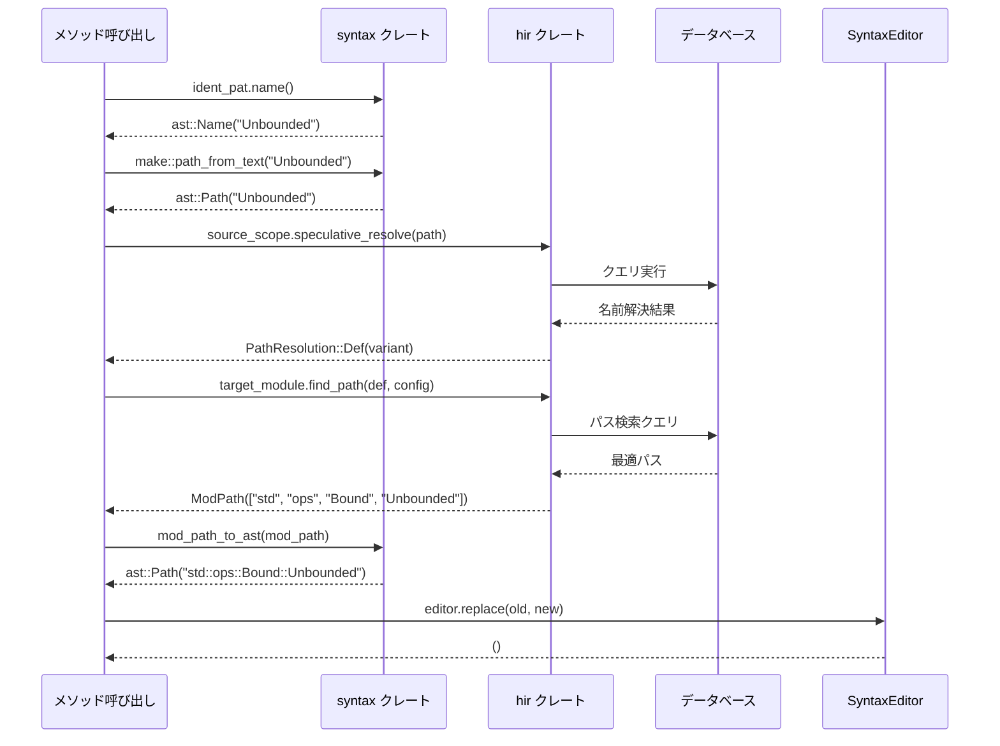

---

## 📝 ステップ1: 名前抽出 `ident_pat.name()`

### モジュール依存関係
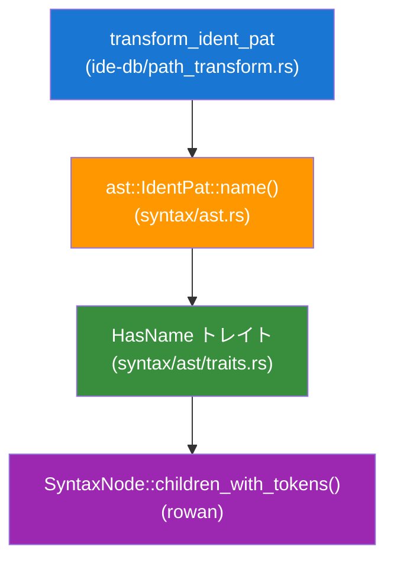

### 実際の処理詳細
```rust
// syntax/ast/traits.rs
impl HasName for ast::IdentPat {
    fn name(&self) -> Option<ast::Name> {
        self.syntax()                    // SyntaxNode を取得
            .children_with_tokens()       // 子トークンを走査
            .find(|it| it.kind() == SyntaxKind::NAME)  // NAME トークンを検索
            .and_then(|it| ast::Name::cast(it.as_node()?.clone()))  // ast::Name に変換
    }
}
```

### データ変換の流れ
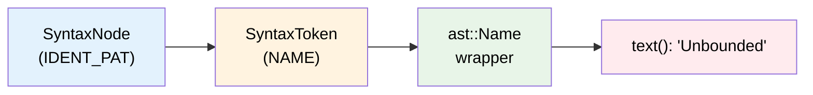

---

## 🔧 ステップ2: 一時パス作成 `make::path_from_text()`

### モジュール依存関係
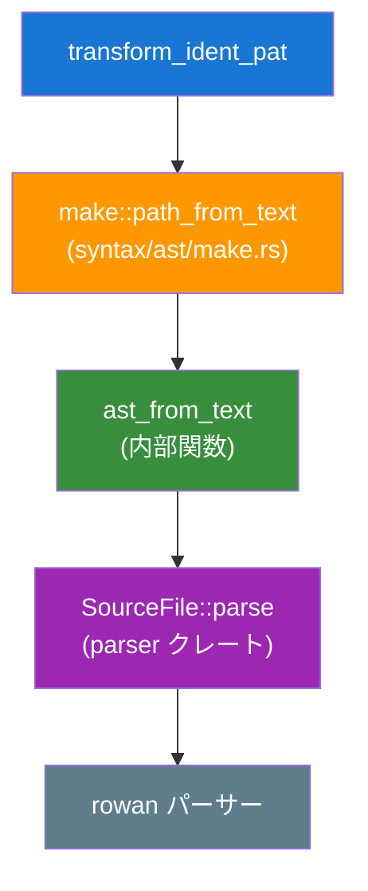

### 内部処理の詳細
```rust
// syntax/ast/make.rs
pub fn path_from_text(text: &str) -> ast::Path {
    ast_from_text(&format!("use {};", text))  // "use Unbounded;" を作成
}

fn ast_from_text<N: AstNode>(text: &str) -> N {
    let parse = SourceFile::parse(text, Edition::CURRENT);  // パース実行
    let file = parse.tree();                                // AST取得
    find_node_at_offset(file.syntax(), TextSize::of("use "))  // useの後を検索
        .unwrap()
}
```

### 変換プロセス


---

## 🧠 ステップ3: 名前解決 `speculative_resolve()`

### モジュール・システム間の依存関係
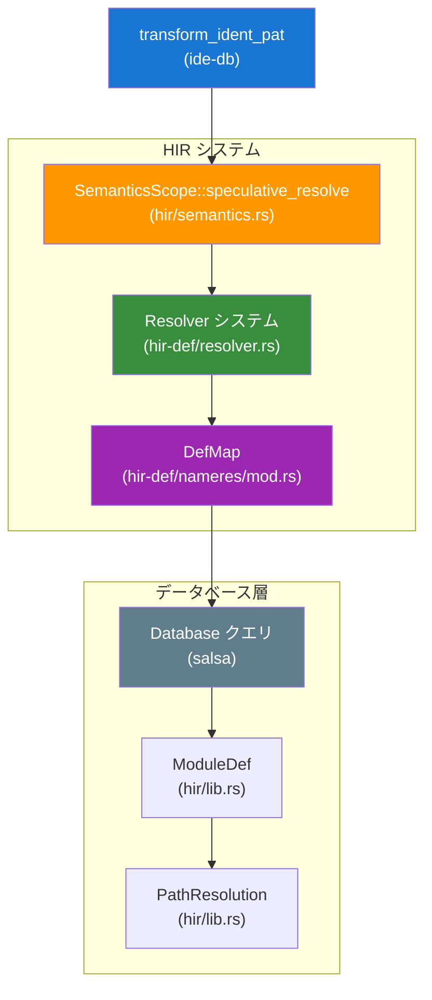

### 名前解決の詳細プロセス
```rust
// hir/semantics.rs
impl SemanticsScope<'_> {
    pub fn speculative_resolve(&self, path: &ast::Path) -> Option<PathResolution> {
        let resolver = self.resolver()?;
        let resolved = resolver.resolve_path_in_value_ns(path.clone())?;
        Some(PathResolution::from(resolved))
    }
}
```

### 解決ステップの詳細
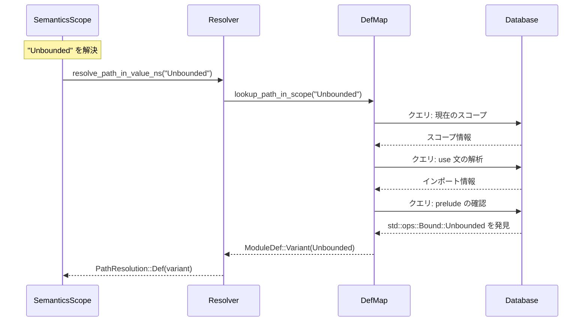

---

## 🎯 ステップ4: 解決結果の判定

### パターンマッチの詳細
```rust
match resolution {
    // ✅ 通常の定義かつ非関連アイテム
    hir::PathResolution::Def(def) if def.as_assoc_item(self.source_scope.db).is_none() => {
        // パス変換処理へ
    }
    
    // ❌ その他のケース
    hir::PathResolution::Def(def) => None,         // 関連アイテム
    hir::PathResolution::Local(_) => None,         // ローカル変数
    hir::PathResolution::TypeParam(_) => None,     // 型パラメータ
    _ => None,                                     // その他
}
```

### 判定フローチャート
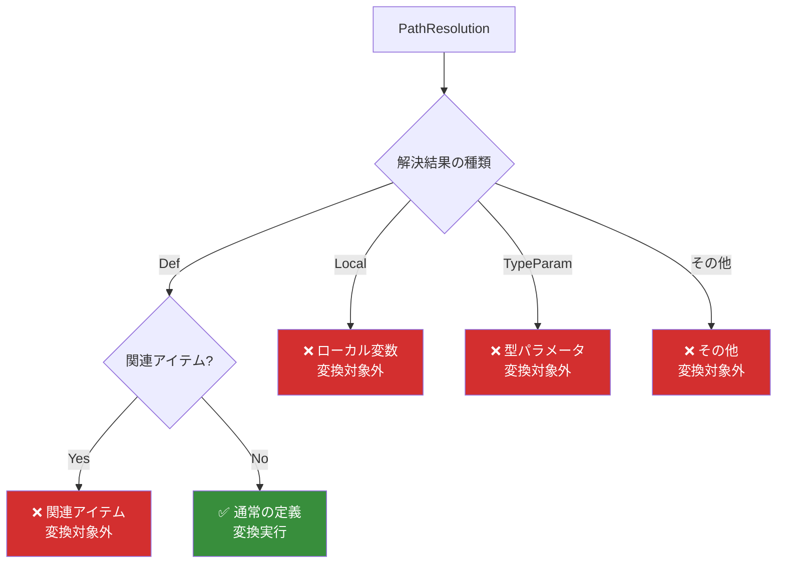

---

## 🗺 ステップ5: パス検索 `find_path()`

### モジュール依存関係
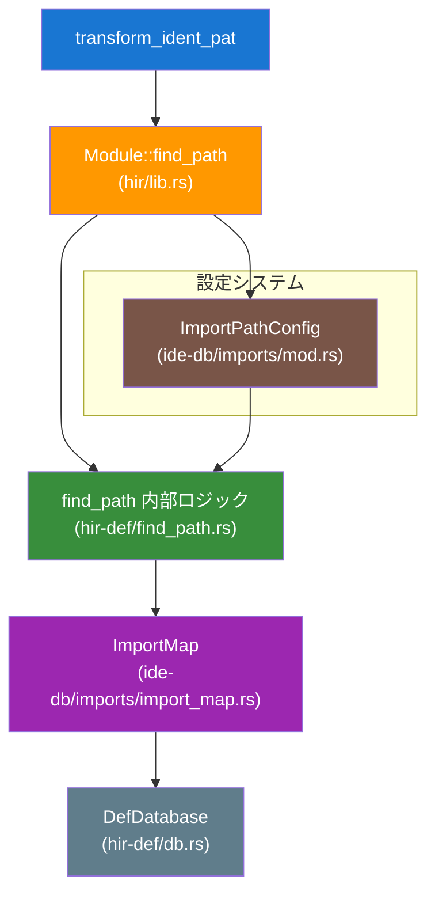

### ImportPathConfig の詳細
```rust
let cfg = ImportPathConfig {
    prefer_no_std: false,      // std の代わりに core を使うか
    prefer_prelude: true,      // prelude 項目は短縮するか
    prefer_absolute: false,    // 絶対パス vs 相対パス
    allow_unstable: true,      // unstable 機能を許可するか
};
```

### パス検索アルゴリズム
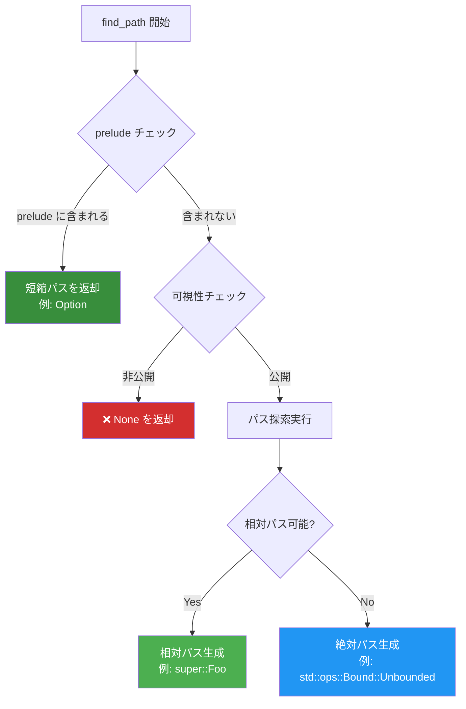

---

## 🏗 ステップ6: AST変換 `mod_path_to_ast()`

### データ変換の流れ
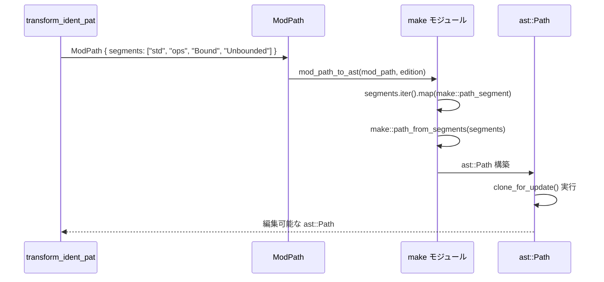

### AST構築の詳細
```rust
// syntax/ast/make.rs
pub fn mod_path_to_ast(path: &ModPath, edition: Edition) -> ast::Path {
    let segments = path.segments.iter().map(|name| {
        let name_ref = make::name_ref(&name.display(edition).to_string());
        make::path_segment(name_ref)
    });
    
    make::path_from_segments(segments, path.kind == PathKind::Plain)
}
```

---

## ✏️ ステップ7: ノード置換 `editor.replace()`

### SyntaxEditor の動作
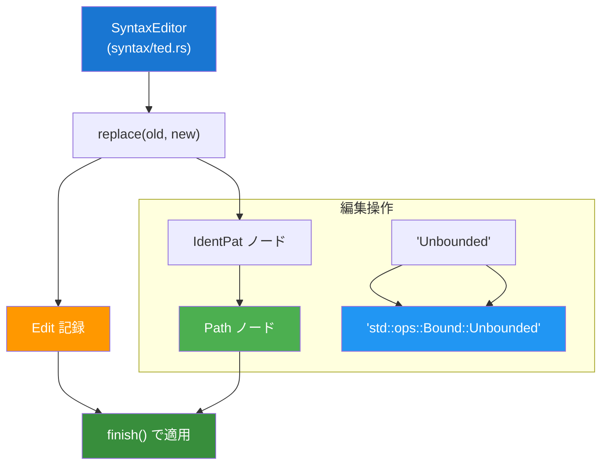

### 型安全な置換
```rust
// 置換前: ast::IdentPat
let old_node: &SyntaxNode = ident_pat.syntax();  // IDENT_PAT ノード

// 置換後: ast::Path  
let new_node: SyntaxNode = res.syntax().clone(); // PATH ノード

// SyntaxEditor による安全な置換
editor.replace(old_node, new_node);  // 型は実行時にチェック
```

---

## 📊 全体的なモジュール依存マップ

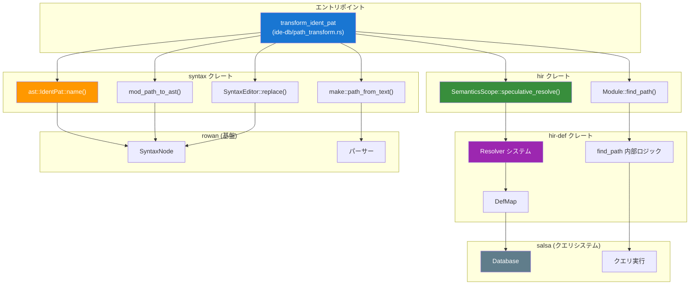

---

## 🎯 まとめ

### 処理の要点
1. **AST操作** (syntax): 構文レベルでの名前抽出・変換・置換
2. **セマンティック解析** (hir): 意味的な名前解決とパス検索  
3. **データベース** (salsa): 効率的なクエリ実行とキャッシュ
4. **エディター** (ted): 安全なAST変更操作

### 設計の優秀さ
- **レイヤー分離**: 各クレートが明確な責任を持つ
- **型安全性**: コンパイル時・実行時の両方で安全性を確保
- **拡張性**: 新しいノード型への対応が容易
- **効率性**: クエリシステムによる最適化されたパフォーマンス

この`transform_ident_pat`メソッドは、rust-analyzerの設計哲学を体現した優れた実装例です。